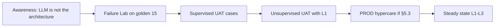

# Adoption Strategy — SME Credit Underwriting Intelligence Workbench

**Compiled:** 2026-09-10  
**Companions:** `artefacts/CHANGE_MANAGEMENT_PLAN.md`, `artefacts/TRAINING_PLAN.md`, `artefacts/SUCCESS_METRICS.md`, `artefacts/SUPPORT_MODEL.md`  
**CRD IDs:** `CRD-BR-001`–`004`, HG-01–HG-08, QT-01–QT-05, G-UI-01  
**Status:** How adoption is earned **without** weakening gates. Production adoption is **not** in progress.

---

## 1. Adoption definition

A user has **adopted** the workbench when they:

1. Complete assigned underwriting tasks **in** the workbench (not a side chatbot);
2. Leave stale/missing/conflict **visible**;
3. Treat AI output as assistance and record human action in Human Decision;
4. Follow **engine** required role;
5. Use Failure Simulation / degraded modes instead of inventing facts;
6. Send AI accept/modify/reject to governed review — not to the catalog.

Adoption is **not**: volume of memos generated, or TAT on the 160-row fixture.

---

## 2. Adoption barriers (detail)

### 2.1 Product and process

| Barrier | Why it appears | Adoption design |
|---|---|---|
| No workbench yet | 0/12 screens | Do not mandate usage; Phase 0 is awareness only |
| Nine-system muscle memory | 57% of sampled cases >3 lookups | Control Tower + Evidence Reconciliation as the default open; measure SM-06 only after UI exists |
| Memo as the decision | Historical free-text culture | Banner: memo ≠ HumanDecision; GS-14 reject path |
| Policy PASS = approve | Semantic confusion (SC-08) | Training + Policy & Authority screen |
| Missing vs exception | Same queue historically | Explicit mode labels; GS-06/07 labs |
| Identity “clean up” | Desire for one name | Reward keeping AMBIGUOUS (GS-04) |
| Fairness as a score | Exec pressure | Eval-mode cohort only; no cutoff KPI |

### 2.2 People and incentives

| Barrier | Why | Design |
|---|---|---|
| TAT bonus without gate bonus | 142 → <30 pressure | Scorecards: HG-* first, then SM-01 on **named** population |
| Fear of audit | 13.7% missing source refs | HG-03 as a **help**: provenance is the job, not extra work |
| Fear of replacement | “AI will take decisions” | Repeat: AI cannot approve; authority users remain mandatory |
| Over-trust of fluent text | GS-14 trap | Invented-threshold drills before memo access |
| VIP / channel pressure | RM wants speed | RM has no decision; isolation never waived |

### 2.3 Trust and control

| Barrier | Why | Design |
|---|---|---|
| Injection documents | GS-09 | Teach “DATA not instructions”; support never follows them |
| Cross-tenant curiosity | GS-08 | DENY is success; not a defect |
| AI outage | GS-10 | Drill manual path until it is faster than waiting for the model |
| Rollback folklore | “Use 2.9” | Comms + G-RB-01: never 2.9 |

---

## 3. Enablement sequence (adoption, not just training)

| Step | Adoption proof |
|---|---|
| A | Can state: assistance ≠ decision; 3.2 ACTIVE; three TAT populations |
| B | Completes GS-08/09/10/14 without asking to bypass |
| C | Completes L001 + L005 + L011 with grounded memo + human action |
| D | No Sev 1 from user behaviour in two UAT weeks (clocks OPEN) |
| E | HG-* still 0/100%/true on workbench path; SM-05/06 directional only if measured |
| F | Support handles how-to; control breaches still Sev 1 |

---

## 4. Persona adoption plays

| Persona | First value | First friction | Play |
|---|---|---|---|
| Analyst | Provenance-bearing context | Slower than a chatbot | Time-to-grounded-memo vs copy-paste; not raw TAT |
| Senior UW | Clean exception vs missing-data split | Extra click vs old queue | GS-06/07 side-by-side |
| Credit authority | Engine role visible | LOS title mismatch | GS-02 as the teaching case |
| RM | Source health on assigned apps | Cannot approve | Explicit non-goal |
| Risk/compliance eval | Safe cohort view | No runtime features | Purpose banner; sample never in underwriting |
| Exec | Trustworthy AI story | Wants 30 min now | Steerco script from change plan |

---

## 5. Success measurements for adoption

Hard gates **first**. Then value. Do not mix populations (`SUCCESS_METRICS.md`).

### 5.1 Adoption hygiene (leading)

| Metric | Target | Layer |
|---|---|---|
| Users completing Failure Lab | 100% of UAT/PROD named cohort | UAT+ |
| GS-14 / GS-09 / GS-10 user drills pass | 100% before memo access | UAT+ |
| Tickets asking to “just approve” / “turn off tenant filter” | Trend to 0; each is coaching or Sev 1 | UAT/PROD |
| Memos with HG-03 = 100% on UI | 100% of emitted FACT memos | Workbench |
| `AI_ACCEPTED` writes to catalog | 0 (G-FB-01) | All |

### 5.2 Control (must stay green)

HG-01–HG-08 and QT-01 on the **claimed** layer. Adoption campaigns **stop** if these regress.

### 5.3 Value (lagging, after gates)

| ID | Adoption-relevant reading |
|---|---|
| SM-05 | Memo minutes down from 38 **without** invented facts |
| SM-06 | Fewer >3-system lookups vs 57% baseline |
| SM-07 | Document rework vs 31.2% |
| SM-02 | Missing source-ref vs 13.7% |
| SM-08 | L006/L007 not collapsed |
| SM-01 | <30 min only on **named production** population |

Workshop 89.5 / source 142 are **not** adoption success.

### 5.4 Reporting

Steerco 30/60/90: hygiene + HG + (if UI) SM-05/06 samples. Independent reviewer challenges TAT labelling.

---

## 6. Support transition

| Stage | Support | Exit to next |
|---|---|---|
| Phase 0 | Engineering only (tests) | G-UI-01 |
| UAT week 1–2 | **Hypercare:** Engineering + Credit Operations in-room / huddle; L1 shadow | Failure Lab complete; no Sev 1 from process |
| UAT week 3+ | L1 Credit Operations; L2 as `SUPPORT_MODEL.md` | Ticket mix is how-to, not gate-bypass |
| PROD 30 days (if GO) | Hypercare rota (clocks **OPEN** until Ops names) | HG green on UI; G-RB-01 done |
| Steady | L1–L3; IR for Sev 1 | Delivery not on every how-to |

**Transition rules**
- Engineering does not remain L1 after hypercare exit.
- L1 never gains credit authority “to help adoption.”
- Known issues (stale visible, DENY cross-tenant) are **trained**, not ticketed as P1 defects.
- Recourse/applicant questions stay Case Management, not the model.

---

## 7. Anti-adoption (stop)

- Shadow GPT with application PDFs.
- Spreadsheet “revenue” blending bank and tax.
- Bonus on TAT that ignores HG-*.
- UAT on production-like PII without IAM.
- Declaring adoption success from contract 15/15 PASS.

---

## 8. Current adoption state (2026-09-10)

| Cohort | State |
|---|---|
| Delivery / policy / eval owners | Can adopt **contract** evidence; not the product UI |
| Analysts / authority / RM | **Not started** — no screens |
| Org-wide | **Do not launch** usage mandate |

Next adoption move: when Control Tower + Human Decision exist, run a **named UAT cohort** through Failure Lab before any memo-volume target.
