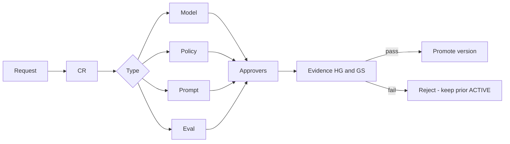

# Approval Workflows — SME Credit Underwriting Intelligence Workbench

**Compiled:** 2026-09-10  
**CRD IDs:** `CRD-FR-010`, `CRD-SEC-002`, `CRD-SEC-012`, `CRD-TOOL-004`, `CRD-TOOL-009`, `CRD-TOOL-010`, `CRD-AC-012`, `CRD-AC-014`, `CRD-AC-015`, HG-02, HG-06, HG-07, G-POL-*, G-FB-*  
**Companions:** `artefacts/GOVERNANCE_FRAMEWORK.md`, `artefacts/CHANGE_CONTROL_PROCESS.md`, `RELEASE_GATES.md`  
**Status:** Target workflows. Dual-control production operations are **NOT PROVEN**. `AI_ACCEPTED` is never an approver.

Each workflow: trigger → CR → spec (if intent) → required approvers → evidence → promote / reject. Clock-times for SLA of approval are **OPEN** until Operations names them.

---

## 0. Common gates (all four workflows)

- [ ] `CRD-CR-YYYY-NNN` filed from `CR_TEMPLATE.md`
- [ ] Affected `CRD-*`, GS, and hard guardrails listed
- [ ] Specs/traceability updated **before** artifact promotion when intent changes
- [ ] Prior evidence preserved (no overwrite)
- [ ] Feedback path cannot perform the write (`FEEDBACK-001`)
- [ ] Traces will record new versions (`NONE` forbidden if the artifact is actually called)
- [ ] High-impact authority/control: named human reviewer ≠ sole implementer

**Reject immediately if:** the change grants AI final credit; fails-open tenant isolation; treats documents as instructions; invents extra credit thresholds; activates v2.9 as ACTIVE; uses fixtures as live credit data.

---

## 1. Model changes

**In scope:** new/replaced LLM, embedding model for narrative retrieval, temperature/tool-calling wrapper, “no model” → live model.

**Out of scope:** deterministic memo stub with `versions.model=NONE` remaining honest.

| Step | Action | Owner |
|---|---|---|
| 1 | CR: why current model insufficient; data/privacy impact; will outputs still be `Recommendation` only? | Model risk (requester may be Engineering) |
| 2 | If product intent changes (e.g. new tool that could persist decisions): spec first | Spec owner |
| 3 | Sandbox in DEV/TEST only; production adapters off | Engineering |
| 4 | Run GS-09, GS-14, GS-08 (if retrieval), GS-10 (outage still fallback), HG-01/02/07 | Model risk / evals |
| 5 | Approve or reject | **Accountable: Model risk / evals.** Consult Credit Policy if generated text could be read as thresholds. Veto: any HG-02/07 fail |
| 6 | Promote model id; set `versions.model`; model-risk file required before PROD | Model risk |
| 7 | Production | Independent reviewer only after `RELEASE_GATES.md` §5.3 |

**Approvers**

| Role | Vote |
|---|---|
| Model risk / evals | **Required** |
| Credit Policy | Required if fidelity/threshold risk |
| Security | Required if retrieval/prompt-injection surface changes |
| Credit authority | Required only if authority boundary could move (should normally be DENY → CR class A) |
| `AI_AGENT` / `AI_ACCEPTED` | **Forbidden** |

**Evidence:** eval report id; GS-14 invented-threshold probe still critical fail; `FALLBACK-001` still true with model killed.

---

## 2. Policy changes

**In scope:** ACTIVE catalog text, effective date, AUTH-* / DATA-FRESHNESS / exception routes, which bundle is ACTIVE.

**Out of scope:** showing v2.9 as historical `controlling=false`; GS-07 human exception **without** catalog rewrite.

| Step | Action | Owner |
|---|---|---|
| 1 | CR: proposed spec text; impact on SME-L002/007/012/014; no extra invented cut-offs unless explicitly in the CR | Credit Policy |
| 2 | Dual-control: author ≠ approver | Second Credit Policy (or designated policy owner) |
| 3 | If AUTH-LIMIT or adverse/exception routes change | Credit authority **required** |
| 4 | Spec + engine fixture/docs updated first | Spec owner / Credit Policy |
| 5 | TEST: GS-12 (3.2 controlling), GS-14 (no invented extras), GS-02/07/13 as affected | Model risk / evals + Engineering |
| 6 | Activate new ACTIVE; retain previous ACTIVE for rollback | Credit Policy |
| 7 | G-RB-01: prove restore of **previous ACTIVE**, never 2.9 | Operations + Credit Policy |

**Approvers**

| Role | Vote |
|---|---|
| Credit Policy (second person) | **Required (dual-control)** |
| Credit authority | Required for authority-route / limit / adverse changes |
| Independent reviewer | Required for production catalog |
| Generation / similarity | **Forbidden** |

**Evidence:** content hash of ACTIVE bundle; engine required roles; HG-06 = 0; rollback drill note.

Known workshop literals unless a CR explicitly replaces them: INR **5,000,000** (`AUTH-LIMIT-01`); bank **7 days**. Do not “slip in” other cut-offs in a prompt or memo.

---

## 3. Prompt changes

**In scope:** system prompt, tool-orchestration prompt, memo-section instructions, any text in the **instruction** channel.

**Out of scope:** applicant document text, historical memos, retrieved narrative (those stay DATA).

| Step | Action | Owner |
|---|---|---|
| 1 | CR: instruction vs data boundary; tenant scope unchanged; AI still cannot approve | Model risk |
| 2 | Spec if the prompt encodes new product intent (thresholds, roles) — **do not put policy literals only in the prompt** | Spec owner; policy stays in catalog |
| 3 | TEST: GS-09 (injection still DATA), GS-14 (prompt cannot create thresholds), GS-08 (prompt cannot widen tenant), HG-01 | Engineering + Model risk |
| 4 | Approve | **Model risk / evals.** Security **required**. Credit Policy if wording could be mistaken for ACTIVE rules |
| 5 | Promote `versions.prompt`; traces record it | Engineering |

**Approvers**

| Role | Vote |
|---|---|
| Model risk / evals | **Required** |
| Security / privacy | **Required** |
| Credit Policy | Required if policy-like instructions |
| Applicant document / memo corpus | **Forbidden as instruction source** |

**Evidence:** side-by-side prompt diff; GS-09 DENY `FOLLOW_DOCUMENT_INSTRUCTION`; policy hash unchanged unless a **policy** CR ran in parallel.

---

## 4. Evaluation changes

**In scope:** golden-scenario expected behavior, `hard_fail_if`, suite dimensions, gold labels, acceptance thresholds YAML, adding/removing a GS mapping to ACs.

**Out of scope:** a single failing implementation (fix code, do not loosen gold).

| Step | Action | Owner |
|---|---|---|
| 1 | CR: why current AC/eval is insufficient; **do not** edit original case evidence to match code | Model risk + spec owner |
| 2 | If AC/GS meaning changes: update `ACCEPTANCE_CRITERIA.md` and traceability **first** | Spec owner |
| 3 | Invented-threshold dimension remains **critical** | Non-negotiable |
| 4 | QT-01 rule remains ≥95% **and** all hard-gate scenarios passing | Non-negotiable |
| 5 | Restricted eval sample remains evaluation-only | Risk / compliance eval if fairness rows change |
| 6 | Approve | **Model risk / evals** + **spec owner**. Independent reviewer if HG definitions change |
| 7 | Version gold + suite; protected hashes update only via this CR | Engineering |

**Approvers**

| Role | Vote |
|---|---|
| Model risk / evals | **Required** |
| Spec owner | **Required** if AC/GS text changes |
| Independent reviewer | Required if HG/QT pass criteria change |
| `AI_ACCEPTED` / portfolio outcome | **Forbidden** as gold |

**Evidence:** diff of `expected_behaviors.json` / `acceptance_thresholds.yaml`; re-run `CRD-TOOL-009`; layer labelled (must not claim workbench QT-01 from contract-only).

Empty `hard_fail_if` arrays on GS-01/03/04/10/15 stay a known spec-quality residual: AC text remains normative; do not treat empty arrays as approval to drop hard fails.

---

## 5. Combined promotions

| If promoting together | Order |
|---|---|
| Policy + prompt | Policy CR first; prompt must not be the only home of the rule |
| Model + eval | Eval (gold) not auto-updated from model outputs; then model vs **frozen** gold |
| Prompt + eval | Prompt, then eval on the new prompt; do not retune gold to hide GS-14 |
| Any of the above + production release | All CRs closed; then `RELEASE_GATES.md` §5.3 as a **separate** approval |

Production release approvers (not substitutable by the four workflows above): Credit authority, Policy owner, Security/privacy, Model risk/evals, Operations, **independent reviewer**. Pending as of 2026-09-10.

---

## 6. Workflow readiness (2026-09-10)

| Workflow | Contract denylist | Dual-control ops | PROD |
|---|---|---|---|
| Model | N/A (`NONE`) | NOT PROVEN | BLOCKED |
| Policy | 3.2 vs 2.9 tests PASS | NOT PROVEN (G-RB-01 FAIL) | BLOCKED |
| Prompt | Injection tests PASS | NOT PROVEN | BLOCKED |
| Evaluation | Suite 15/15 contract | Gold write-protect PASS | Workbench/production QT-01 not claimed |

These workflows do not themselves close production GO.
