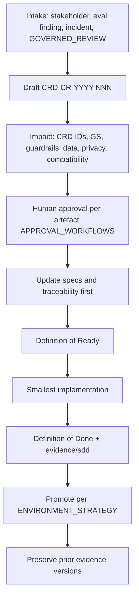

# Change Control Process — SME Credit Underwriting Intelligence Workbench

**Compiled:** 2026-09-10  
**Normative stub:** `CHANGE_CONTROL.md` (this artefact expands it; the stub still wins if they conflict)  
**CRD IDs:** `CRD-FR-010`, `CRD-SEC-012`, `FEEDBACK-001`, `CRD-NFR-007`  
**Templates:** `specs/09_change_requests/CR_TEMPLATE.md`, `.cursor/commands/sdd-change.md`  
**Companions:** `artefacts/GOVERNANCE_FRAMEWORK.md`, `artefacts/APPROVAL_WORKFLOWS.md`, `DEFINITION_OF_READY.md`, `DEFINITION_OF_DONE.md`  
**Status:** Target process. Workshop CRs `CRD-CR-2026-001`–`014` already used this pattern. Production dual-control operations remain **NOT PROVEN**.

---

## 1. Trigger

Start change control when any of these would move:

- Product intent, `CRD-BR/FR/NFR/SEC/AC/DATA/TOOL` text, or golden-scenario expected behavior
- ACTIVE policy, engine routes, or known literals (INR 5,000,000 / 7-day bank freshness)
- Model, prompt, ontology, semantic definition, KG schema, retrieval policy, gold labels
- Production adapters, IAM, or release gates
- A `GOVERNED_REVIEW` item that requests a catalog write

Do **not** start a CR to “fix” a test by editing original case fixtures.

---

## 2. Process

### Step 1 — Create the change request

Use `CR_TEMPLATE.md`. Required fields: CR ID, requester, date, problem, why current spec is insufficient, affected requirement IDs, affected AC/GS, affected hard guardrails, data/authority impact, privacy/security/safety, backward compatibility, proposed spec text, approval, tasks, verification evidence.

ID pattern: `CRD-CR-YYYY-NNN`.

### Step 2 — Impact analysis (mandatory)

| Lens | Questions |
|---|---|
| Requirements | Which `CRD-*` change? Does an AC exist and stay testable? |
| Golden scenarios | GS-01–GS-15 still hold? Empty `hard_fail_if` must not be read as “no fail” |
| Guardrails | Any Decision_Guardrails / HG-* weakened? If yes, independent reviewer |
| Authority | Engine role vs LOS assignment; AI still DENY on forbidden actions? |
| Data | Freshness, conflict, identity AMBIGUOUS preserved? Fixtures unaltered? |
| Privacy | Restricted eval still out of runtime? Purpose limitation? |
| Compatibility | Migration of traces/versions; no silent rewrite of gold |
| Layer | Contract / workbench / production — which claim will this evidence support? |

`OPEN_DECISION` items that block implementation must be resolved or explicitly out of scope (`DEFINITION_OF_READY.md`).

### Step 3 — Approval

Route using `artefacts/APPROVAL_WORKFLOWS.md`. Workshop/team human approval is already required by `CHANGE_CONTROL.md` step 4. High-impact authority/control changes need a named human reviewer who is not solely the implementer.

**Forbidden auto-approvals:** model confidence, `AI_ACCEPTED`, vector similarity, passing a demo screenshot, `scripts/sdd_validate.py` pack check alone.

### Step 4 — Specifications first

Update `specs/` (and traceability) **before** implementation. Then re-plan tasks. Cursor `/sdd-change` → `/sdd-spec` → `/sdd-plan` → `/sdd-implement`.

### Step 5 — Implement the smallest coherent slice

Cite CRD IDs in the task. Do not bundle unrelated FRs. Do not refactor unrelated code.

### Step 6 — Verify and record evidence

- Narrow test first, repository sanity second.
- Store fresh evidence under `evidence/sdd/`.
- Update `TRACEABILITY_MATRIX.md` status only with that evidence.
- Never mark PASS without fresh repo evidence.
- Do not overwrite prior evidence.

### Step 7 — Promote

DEV → TEST → UAT → PROD per `ENVIRONMENT_STRATEGY.md` and `RELEASE_GATES.md`. A CR that is TEST-green is not a production GO.

---

## 3. Change classes

| Class | Examples | Minimum bar |
|---|---|---|
| **A — Guardrail / authority** | AI final credit, tenant filter, injection DATA channel, policy controlling version | Dual-control + independent or named authority reviewer; HG re-run on claimed layer |
| **B — Policy catalog** | ACTIVE bundle text, AUTH-LIMIT-01, freshness rule | Dual-control Credit Policy; GS-12/14; never v2.9 as rollback |
| **C — Model / prompt** | New model id, system prompt, tool-calling wrapper | Model risk approval; versions in traces; GS-09/14; instruction channel unchanged |
| **D — Evaluation / gold** | expected_behaviors, suite dimensions, gold labels | Model risk + spec owner; invented threshold remains critical |
| **E — Feature / adapter** | Workbench screen, production LOS adapter | DoR/DoD; GS for the slice; fixtures not used as live data |
| **F — Operational** | Probe, retention **days** (Legal), on-call clocks | Owner names OPEN items; no new credit thresholds |

If a change spans classes, apply the **strictest** approval.

---

## 4. Intake from feedback and incidents

| Source | Path |
|---|---|
| `capture_outcome_feedback` | Queue `GOVERNED_REVIEW` → human opens CR or rejects. No auto-write |
| Incident IR-HG02 / IR-FB | Contain first (`INCIDENT_RESPONSE_PLAN.md`); CR before permanent catalog change |
| Eval fail | Fix implementation **or** CR if the spec was wrong — never edit original case evidence to pass |

---

## 5. Versioning and identity

Each approved change records:

- CR id  
- Git SHA (when code changes)  
- Policy catalog version + content hash  
- Ontology / semantic version  
- `versions.model` / `versions.prompt` (`NONE` if unused)  
- Eval report id  

Decision traces MUST copy these (`CRD-FR-009`). Rollback restores the prior **ACTIVE** set — not 2.9 (`DR_STRATEGY.md`).

---

## 6. Ready / done gates

**Ready** (`DEFINITION_OF_READY.md`): named `CRD` id, domain evidence, testable AC, listed guardrails, known freshness/conflict, explicit human/deterministic authority, blocking OPEN_DECISIONs resolved or out of scope, files and verification known.

**Done** (`DEFINITION_OF_DONE.md`): behavior maps to CRD ids; AC/GS pass or explained non-pass; guardrails not weakened; stale/missing/conflict tested where relevant; authority deterministic; trace reconstructable; sanity check; traceability updated; `evidence/sdd/` stored; human review of high-impact authority/control change.

---

## 7. What this process does not do

- Authorize production lending
- Let generation modify ACTIVE policy
- Treat workshop fixture TAT as QT-05
- Replace `CHANGE_CONTROL.md` with a looser rule
- Close G-RB-01 without a drill
