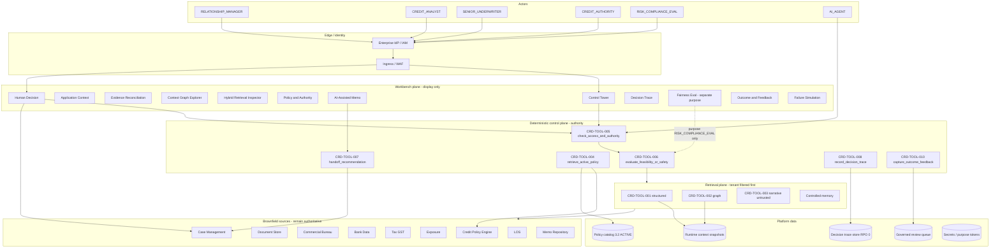
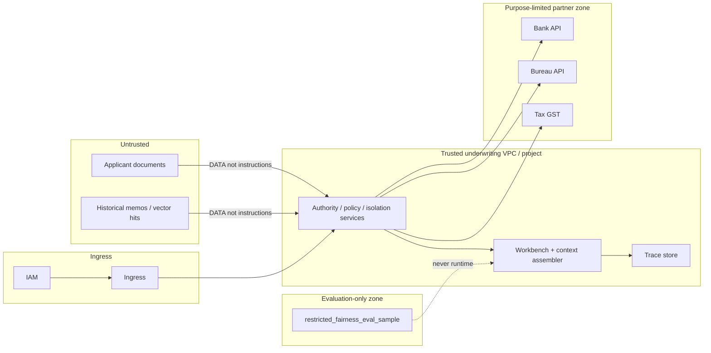
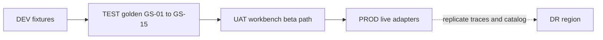

# Deployment Architecture — SME Credit Underwriting Intelligence Workbench

**Organization:** NexLend SME Finance (fictional)  
**Compiled:** 2026-09-10  
**CRD IDs:** `CRD-FR-001`–`011`, `CRD-NFR-002`–`007`, `CRD-SEC-001`–`012`, `CRD-TOOL-001`–`010`, `CRD-DATA-008`–`013`, HG-01–HG-08  
**Companions:** `artefacts/ENVIRONMENT_STRATEGY.md`, `artefacts/DR_STRATEGY.md`, `artefacts/NFR_SPECIFICATION.md`, `RELEASE_GATES.md`  
**Status:** Target enterprise deployment architecture. **Production GO remains BLOCKED** until `RELEASE_GATES.md` §5.3 is evidenced. This file does not mark any `CRD-FR-*` row `VERIFIED` and does not replace LOS, bureau, bank, tax, exposure or policy systems with generated data.

**Cloud vendor, region pair and instance sizes are OPEN** (not in case evidence). Components below are logical; they map to any enterprise platform that can enforce tenant isolation **before** retrieval.

---

## 1. Deployable target (honest current vs intended)

| Layer | This repository today | Enterprise target |
|---|---|---|
| Contract gates | `src/credit_domain` + `evidence/sdd/` | Same gates as a versioned service; screens display them, they are not the control plane |
| Workbench | **0/12 screens** | Twelve experiences in `google_ai_build/03_APP_SCREEN_REQUIREMENTS.md` |
| Adapters | Fixture file readers | Named live adapters: LOS, DOCS, BUREAU, BANK, TAX, EXPOSURE, POLICY, CASE, MEMO |
| Graph | In-memory JSON slice; ADR Template 06 unfilled | Persistence per accepted graph ADR (P2-06); prototype MAY still simulate if authority stays visible |
| AI | Deterministic memo stub; `versions.model=NONE` | Optional LLM behind `CRD-TOOL-004`–`007`; outage → `FALLBACK-001` |
| Identity | Workshop TENANT-ALPHA / TENANT-BETA | Production IAM; workshop pair is **not** the production tenancy design |
| Production | BLOCKED | Allowed only after §8 readiness criteria |

---

## 2. Logical deployment architecture

Credit authority, policy version and tenant filters sit **outside** generation. AI is an analysis component, not a runtime dependency for human decisioning (`NFR-AVAIL-01`).

**Invariant:** `DATA-TENANT` and `check_access_and_authority` run before any structured, graph, vector, memory, context, tool or display adapter. Prompt text cannot widen tenant scope. Fairness/Impact Eval is a **separate purpose**, not a runtime feature flag.

---

## 3. Trust and network boundaries

| Boundary | Enforcement | Proof |
|---|---|---|
| Tenant | Code filter before retrieval (`CRD-DATA-012`) | HG-04 / GS-08 |
| Document instruction | DATA channel (`DATA-DOC-INSTRUCTION`) | HG-07 / GS-09 |
| Restricted eval | Separate store + purpose | HG-05 / GS-03 / GS-15 |
| Policy authority | Version/date retrieve, not similarity | HG-06 / GS-12 |
| Credit authority | Engine role, not LOS assignment | HG-01 / GS-02 |
| Partner data | Consent/purpose on envelopes | NFR-PRIV-02 |

Production IAM, secrets management, network isolation and pentest remain **NOT PROVEN**.

---

## 4. Component bill of materials

| Component | Role | Workshop stand-in | Production mapping (named, not invented vendor) |
|---|---|---|---|
| Workbench UI | Twelve screens; display P0/P1 state | Not implemented | Internal web app behind IdP |
| Context assembler | `assemble_runtime_context` | Python module | Same contract as a service |
| Hybrid retrieval | `route_underwriting` | Fixture readers + lexical narrative | Structured APIs + graph store + vector index + policy service + memory |
| Policy catalog | ACTIVE `CREDIT-POLICY-3.2` | Markdown + engine fixture | Versioned catalog; dual-control edits |
| Authority gate | `CRD-TOOL-005` / `007` | Python | Same; cannot be prompt-only |
| Decision trace store | AT-16 envelope, RPO 0 | In-process writer | Durable store; write barrier before HumanDecision ACK |
| Governed feedback queue | `CRD-TOOL-010` | Python denylist | Queue that cannot write policy/prompts/models/gold |
| Eval suite | `CRD-TOOL-009` | `scripts/run_eval_suite.py` | CI + gated release job |
| Secrets | Purpose tokens, partner creds | None | Enterprise secret store; no secrets in git |
| Observability | Source health, degraded mode, tool failures | Contract inspectable | Metrics/logs/traces; paging (`CRD-NFR-006`) |
| Graph platform | Six representative traversals | In-memory JSON | Per accepted ADR (property / RDF / relational) |

---

## 5. Infrastructure dependencies

Authoritative sources stay **outside** this platform. The workbench consumes them; it does not become fact or policy authority.

| Dependency | Authoritative for | Freshness expectation | Runtime if down | Owner |
|---|---|---|---|---|
| LOS | Application + workflow identity | Near real time | Manual path uses surviving LOS evidence | Lending Operations |
| Document Store | Bytes/version; content untrusted | Event driven | Documents missing → visible gap; not instructions | Lending Operations |
| Commercial Bureau | Provider bureau facts | ≤30 days unless stricter | Explicit unavailable envelope; `REQUIRES_ADDITIONAL_EVIDENCE` | Credit Risk |
| Bank Data | Consented cashflow | ≤7 days (workshop policy) | Stale or unavailable; never invent | Data Partnerships |
| Tax/GST | Declared turnover | Latest available filing | Surface missing; do not blend with bank | Credit Risk |
| Exposure | Internal obligations | ≤15 min | Surface missing; not bureau | Portfolio Risk |
| Credit Policy Engine | Active rules + required role | Active version required | `MANDATORY_ABSTENTION` if policy retrieve out | Credit Policy |
| Case Management | Human decision / recourse | Near real time | Credit record cannot be acknowledged without persist | Credit Operations |
| Memo Repository | Historical narrative only | Historical | Untrusted DATA; not policy | Credit Operations |
| Enterprise IdP | Actor role + tenant | Session | Deny all interactive access | Security |
| Secret store | Partner credentials | n/a | Partner adapters fail closed | Operations |
| Optional LLM | Draft/summarize only | n/a | `AI_ASSISTANCE_UNAVAILABLE`; manual continues | Model risk |

**Must not depend on for credit finality:** vector index, LLM, fairness-eval store, historical memos, superseded policy 2.9.

---

## 6. Environment overlay

Logical environments (detail in `ENVIRONMENT_STRATEGY.md`):

| Environment | Data | Adapters | AI | May take a real credit decision? |
|---|---|---|---|---|
| DEV | Synthetic / fixtures | Mocks + fixtures | Stub or isolated sandbox | **No** |
| TEST | Golden SME-L001–L015 + 160-row workshop (labelled) | Fixture adapters | Stub; optional gated model | **No** |
| UAT | Masked or synthetic UAT book | Pre-prod adapters or recorded fixtures | Gated model optional | **No** (assistance only) |
| PROD | Live partner data | Named production adapters | Optional; fallback mandatory | **Yes — human only** |
| DR | Replicated PROD traces + ACTIVE catalog | Same contracts | Same fallback | Failover of **human** path |

---

## 7. Capacity assumptions

Workshop capacity is **BINDING**. Production concurrency is **OPEN** (`NFR-SCALE-02`) until Operations names it.

| Assumption | Value | Class | Must not be used as |
|---|---|---|---|
| Golden applications | 15 (SME-L001–L015) | BINDING | Production volume |
| Workshop fixture rows | 160 | BINDING corpus | TAT or capacity proof (median 89.5 ≠ QT-05) |
| Source-case baseline TAT | 142 median / 648 P90 | Operating baseline | Product SLO |
| Business TAT | <30 min uncomplicated **and** HG green | BINDING objective | Claimed until named PROD population |
| Interactive context p95 | ≤10 s excluding provider RTT | PROPOSED | Contractual until CR |
| UI availability candidate | 99.5% Control Tower + Human Decision excl. AI | PROPOSED | Credit-path availability (that is HG-08) |
| Concurrent analysts (PROD) | **OPEN** — Operations SHALL name before GO | OPEN | Guessing a headcount here |
| Tenants | Isolation SLO = 0 leaks at any count | BINDING | Workshop ALPHA/BETA as prod IAM |

Sizing rule: scale **gates and trace persist** with decision volume; scale LLM/vector independently. Credit path must remain available if those scale units fail.

---

## 8. Readiness criteria

A deployment is not “done” because diagrams exist. Use the layer that is being claimed.

### 8.1 Contract-layer deploy (today’s honest demo)

- [x] HG-01–HG-08 green on unittest (`evidence/sdd/`)
- [x] Operators told: assistance not a decision; screens missing; TAT not QT-05; 3.2 only active workshop policy
- [ ] Workbench not required for this layer

### 8.2 Workbench deploy (internal beta) — BLOCKED

- [ ] G-UI-01: twelve screens display P0/P1 state
- [ ] Human Decision, Decision Trace, Outcome & Feedback live **before** user-visible memo
- [ ] HG-01–HG-08 re-run on the UI path (checkpoint Q4)
- [ ] No screen bypasses `check_access_and_authority` or tenant filters (checkpoint Q1)
- [ ] CI runs `CRD-TOOL-009`; invented threshold remains critical fail

### 8.3 Production deploy — BLOCKED (`RELEASE_GATES.md` §5.3)

- [ ] Named production adapters; fixtures **not** live credit data
- [ ] G-FB-01–03 green (no silent policy/prompt/model/gold write)
- [ ] G-RB-01 rollback drill recorded; **never** v2.9 as controller
- [ ] Human override drilled: GS-10 + GS-02 + GS-13
- [ ] Human reviewer signs high-impact authority controls
- [ ] Trace write barrier (RPO 0) evidenced
- [ ] Retention **days** named by Legal (NFR-RET-*)
- [ ] Platform availability % named by Operations (NFR-AVAIL-03) **or** explicitly non-claimed
- [ ] QT-05, if reported, uses a production population ≠ 142 and ≠ 89.5
- [ ] Graph ADR accepted **or** JSON simulation with authority still visible
- [ ] Model-risk file if an LLM is wired; `versions.model` / `versions.prompt` not silently `NONE` while calling a live model
- [ ] Independent reviewer: this architecture vs `PRODUCTION_READINESS_REVIEW.md`

**Stop-ship:** yes to “screen bypassed gates,” “generated text used as policy,” or “feedback wrote 3.2/prompts/models/gold.”

---

## 9. Promotion

Environment promotion process is specified in `artefacts/ENVIRONMENT_STRATEGY.md`. Disaster recovery is specified in `artefacts/DR_STRATEGY.md`. Both inherit the hard gates in this architecture: screens display controls; they do not become the control plane.
