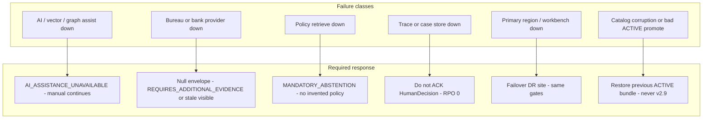

# Disaster Recovery Strategy — SME Credit Underwriting Intelligence Workbench

**Compiled:** 2026-09-10  
**CRD IDs:** `CRD-NFR-004`, `CRD-FR-008`, `CRD-FR-009`, `CRD-SEC-010`, `CRD-DATA-013`, `FALLBACK-001`, `FEEDBACK-001`, HG-08, G-RB-01, NFR-REC-01–03, NFR-AVAIL-01–02  
**Companions:** `artefacts/DEPLOYMENT_ARCHITECTURE.md`, `artefacts/ENVIRONMENT_STRATEGY.md`, `artefacts/NFR_SPECIFICATION.md`, `RELEASE_GATES.md`  
**Status:** Target DR strategy. **G-RB-01 is OPEN and blocks production.** This file is not a completed drill.

**Hard rule:** Superseded `CREDIT-POLICY-2.9` is **never** a production or DR rollback controller.

---

## 1. DR intent

Recover **human underwriting authority**, **ACTIVE policy**, **source-health visibility**, and **reconstructable traces**. Do **not** recover “AI assistance first.”

Credit-path availability during AI loss is already specified as **immediate manual fallback** (`NFR-AVAIL-01`, HG-08). That is an application degraded mode, not a regional failover. Regional DR is additional: restore the workbench, gates, and durable stores when the primary site is gone.



---

## 2. Recovery objectives

| Record / path | RTO | RPO | Class | Source |
|---|---|---|---|---|
| Credit path when AI is down | **0 extra wait** after unavailability detected | n/a | BINDING | NFR-REC-01, HG-08 |
| HumanDecision + AT-16 trace | Decision not confirmed until persist | **0** | BINDING | NFR-REC-03 |
| ACTIVE policy catalog | Until previous ACTIVE restored | Last dual-control version | BINDING never-v2.9; drill OPEN | NFR-REC-02, G-RB-01 |
| Workbench UI + gates (regional) | **OPEN** — Operations names before PROD GO | Trace RPO 0; UI session OPEN | OPEN | NFR-AVAIL-03 |
| LLM restore | **OPEN** — not on the credit-path critical path | n/a | OPEN | Model risk |
| Vector / graph rebuild | Best effort; credit path must not wait | Rebuild from context snapshots/traces if needed | PROPOSED | P2-06 |
| Partner LOS/bureau/bank | Owned by source systems | Per `source_inventory.csv` | BINDING freshness; RTO owned elsewhere | Inventory |

Do not invent a regional RTO hour-count as case evidence. Production GO stays blocked until Operations names regional RTO **and** drills G-RB-01.

---

## 3. What is in the DR package

### 3.1 Must fail over / restore

| Asset | Why |
|---|---|
| Authority + isolation + policy retrieve services | Control plane; screens must not become the authority |
| Human Decision + Control Tower | NFR-AVAIL-03 candidate; HG-08 path |
| Decision trace store | Reconstructability `CRD-FR-009` |
| Case / human-decision records | Recourse and audit |
| ACTIVE policy bundle + hashes | HG-06; dual-control history |
| IAM role/tenant mappings | Isolation survives failover |
| Adapter configuration (not fixture dumps) | Point at surviving source systems |
| Source-health / degraded-mode signals | `CRD-NFR-006` |

### 3.2 Must not fail over as authority

| Asset | Why |
|---|---|
| LLM cache / completions | Assistance only; may be empty |
| Vector index of memos | Untrusted DATA; cannot select policy |
| `restricted_fairness_eval_sample` | Evaluation-only; never runtime |
| `CREDIT-POLICY-2.9` | Historical reference; **not** DR controller |
| Workshop fixture CSVs | Not live credit data |
| `AI_ACCEPTED` gold labels | Not policy |

---

## 4. Failure scenarios and runbooks

### 4.1 AI assistance outage (GS-10 class) — no DR site required

1. Detect `AI_ASSIST=UNAVAILABLE`.
2. Emit `AI_ASSISTANCE_UNAVAILABLE`. Deny fabricated memos.
3. Keep policy 3.2, engine required role, source health visible.
4. Continue `manual_underwriting_view`. SME-L010-class large limit still needs `CREDIT_AUTHORITY`.
5. Record trace: AI unused; human action present.
6. Restore LLM later under model-risk change control. Credit path does not wait.

**Drill:** Failure Simulation + Human Decision. Owner: Credit Operations. Evidence: HG-08.

### 4.2 Bureau unavailable / bank stale (GS-06 / GS-05)

1. Do not invent facts (`NFR-REL-03`).
2. Bureau down → explicit null envelope; `REQUIRES_ADDITIONAL_EVIDENCE`; not a GS-07 policy exception.
3. Bank stale → visible, `presented_as_current=false`; engine PASS does not clear staleness.
4. Structured/policy out → `MANDATORY_ABSTENTION`.

**Drill:** Failure Simulation. Owner: Credit Risk / Data Partnerships.

### 4.3 Trace or case store cannot persist

1. **Do not ACK** `HumanDecision` (`NFR-REC-03`).
2. Operator sees write failure; case remains pending.
3. Fail over trace store to DR replica if primary store is the fault.
4. Replay is **not** an excuse to invent missing portfolio outcomes (G-FB-02).

**Drill:** Chaos on trace write. Owner: Engineering / Operations. Status: **NOT PROVEN**.

### 4.4 Bad ACTIVE policy promote / catalog corruption

1. Freeze new generative assistance if needed; **manual path stays up**.
2. Restore **previous ACTIVE** bundle from dual-control history.
3. **Never** activate `CREDIT-POLICY-2.9`.
4. Re-run GS-12 class check: 3.2 controlling; v2.9 `controlling=false`.
5. Feedback path remains write-protected (`FEEDBACK-001`).

**Drill:** G-RB-01. Owner: Credit Policy + Operations. Status: **FAIL (no drill) — blocks PROD**.

### 4.5 Primary region / workbench loss

```mermaid
sequenceDiagram
  participant Ops as Operations
  participant Pri as Primary site
  participant DR as DR site
  participant LOS as LOS and Policy Engine
  participant Hum as Credit authority human

  Ops->>Pri: Declare site failure
  Ops->>DR: Promote replica gates plus UI plus traces
  Note over DR: Tenant and authority filters still on
  DR->>LOS: Same adapters; fixtures not used
  Hum->>DR: Manual decision if AI also down
  DR->>DR: Persist trace RPO 0 then ACK
  Ops->>Ops: Record drill; never attach v2.9
```

1. Declare incident; do not wait for LLM.
2. Promote DR: IAM, gates, UI, trace replica, ACTIVE catalog.
3. Point adapters at surviving source systems (LOS/policy may still be up in another facility).
4. Verify HG-04 isolation on DR (no cross-tenant “temporary” relax).
5. Human override path: GS-10 + GS-02 + GS-13 class checks.
6. Fail back only after hashes of 3.2 and trace integrity verified.

**Regional RTO:** OPEN until named. Owner: Operations.

### 4.6 Security incident (tenant leak, injection followed)

This is **stop-ship**, not failover to a looser DR.

1. Deny traffic; do not “fail open.”
2. Preserve traces for audit (do not wipe inconvenient evidence).
3. Rotate purpose tokens.
4. Re-run GS-08 / GS-09 before any resume.

Owner: Security / privacy.

---

## 5. Backup and replication

| Store | Replication | Integrity check |
|---|---|---|
| Decision traces | Sync or semi-sync to DR; ACK only after primary persist | AT-16 field completeness; no CoT keys |
| ACTIVE policy | Versioned objects + content hash; dual-control | Hash vs `credit_underwriting_policy_v3_2.md` lineage |
| Case / HumanDecision | Same as traces | Recommendation cannot be stored as HumanDecision |
| Context snapshots | Async acceptable | Must not be used as current policy |
| Vector index | Rebuildable; lowest priority | Untrusted; `controlling=false` |
| Secrets | Independent replica / break-glass | No secrets in traces |

Workshop `evidence/sdd/` reports are **evaluation evidence**, not the production audit store.

---

## 6. DR environment capacity

| Item | Assumption | Class |
|---|---|---|
| Functional parity | Same gates and Human Decision as PROD | BINDING intent |
| Analyst concurrency | Same as named PROD capacity | OPEN until PROD named |
| LLM capacity | May be zero | BINDING (credit path) |
| Fixture load | Forbidden as live book during real failover | BINDING |

---

## 7. Promotion into DR

DR is not a place to test unreleased features.

| Gate | Requirement |
|---|---|
| Only PROD-signed builds | Same SHA + policy hash as PROD |
| Catalog | ACTIVE 3.2 (or later ACTIVE after CR); 2.9 reference-only |
| Data | Replicated PROD traces/decisions; no eval-sample in runtime |
| Drill cadence | G-RB-01 before first PROD GO; then periodic (cadence **OPEN** — Operations names) |
| Sign-off | Operations + Credit Policy + independent reviewer |

---

## 8. Readiness criteria (DR)

Production GO remains **blocked** until these are evidenced — documentation is not a drill.

- [ ] Runbook for §4.1–§4.6 exists and is owned
- [ ] HG-08 / GS-10 executed on the **workbench** path (not only unittest)
- [ ] G-RB-01 catalog restore executed; v2.9 not activated
- [ ] Trace write-fail test: no HumanDecision ACK without persist
- [ ] Regional failover table-top **or** live drill with named RTO
- [ ] Isolation (GS-08) verified on DR
- [ ] Restricted eval sample absent from DR runtime
- [ ] Human override drilled: GS-10 + GS-02 + GS-13
- [ ] Communication: operators told AI may be absent; assistance ≠ decision
- [ ] Post-drill evidence stored (do not overwrite prior inconvenient results)

**2026-09-10:** Contract HG-08 PASS. Workbench drill OPEN. G-RB-01 FAIL. Regional DR NOT PROVEN.

---

## 9. Roles during an incident

| Role | Action |
|---|---|
| Operations | Declare failover; restore stores; paging |
| Credit Operations | Manual underwriting continuity |
| Credit Policy | Catalog restore; never 2.9 |
| Credit authority | Large-limit / adverse on surviving path |
| Security | Isolation/injection incidents; no fail-open |
| Model risk | LLM restore as a **later** change, not a credit prerequisite |
| Independent reviewer | Confirm drill evidence vs this strategy |

No role may grant `AI_AGENT` final credit to “get through the outage.”
