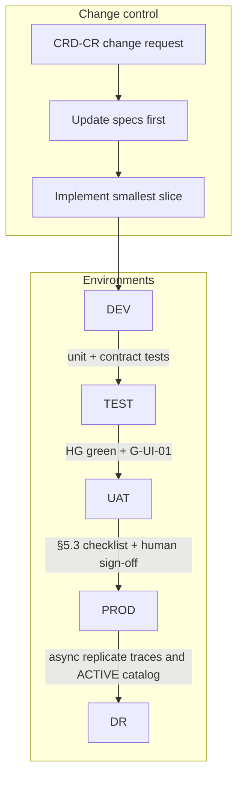

# Environment Strategy — SME Credit Underwriting Intelligence Workbench

**Compiled:** 2026-09-10  
**CRD IDs:** `CRD-NFR-002`, `CRD-NFR-007`, `CRD-SEC-004`–`007`, `CRD-FR-010`, `CRD-AC-001`–`015`, HG-01–HG-08, G-UI-01, G-RB-01  
**Companions:** `artefacts/DEPLOYMENT_ARCHITECTURE.md`, `artefacts/DR_STRATEGY.md`, `artefacts/SLA_SLO_CATALOG.md`, `CHANGE_CONTROL.md`, `RELEASE_GATES.md`  
**Rule:** Code does not redefine product intent. Promotion cannot skip gates. Workshop fixtures are never production credit data (`CRD-NFR-007`).

---

## 1. Environment set

| Environment | Purpose | Maps to release path |
|---|---|---|
| **DEV** | Engineer inner loop; contract tests; fixture-backed adapters | Local / CI only |
| **TEST** | Deterministic GS-01–GS-15; HG-01–HG-08; no live PII | Workshop demonstration (contracts) when green |
| **UAT** | Workbench beta: twelve screens on the path a user sees | `RELEASE_GATES.md` §5.2 — currently **BLOCKED** |
| **PROD** | Live adapters; human credit decisions | §5.3 — currently **BLOCKED** |
| **DR** | Restore human decisioning + traces + ACTIVE policy catalog | `artefacts/DR_STRATEGY.md` |

There is no “prod-like demo on fixtures” that may be labelled production.

---

## 2. Development environment

| Topic | Requirement |
|---|---|
| **Intent** | Change one ready slice (`DEFINITION_OF_READY.md`); run narrow tests then repo sanity |
| **Code** | `src/credit_domain`, `tests/`, workbench when built |
| **Data** | Only `evidence/` synthetic fixtures. TENANT-ALPHA/BETA isolation still enforced in code |
| **Secrets** | No partner credentials. No `.env` with live keys in git |
| **AI** | Memo stub or developer-sandbox model. `versions.model` honest (`NONE` if unused) |
| **Policy** | Local copy of `CREDIT-POLICY-3.2`. v2.9 REFERENCE_ONLY. Feedback path cannot write either |
| **Restricted eval** | File present for negative tests; must not enter runtime context |
| **May decide credit?** | **No** |
| **Exit to TEST** | Unit tests for the slice; `scripts/sdd_validate.py` pack check is **not** behavior proof |

**Readiness (DEV)**

- [ ] Change cites `CRD-*` IDs
- [ ] Acceptance criterion exists and is testable
- [ ] Fixtures unmodified to “make the demo pass”
- [ ] Tenant filter and authority gate callable locally

---

## 3. Test environment

| Topic | Requirement |
|---|---|
| **Intent** | Reproducible golden-scenario verification (`CRD-NFR-007`) |
| **Data** | `live_applications.csv` SME-L001–L015; 160-row fixture **labelled workshop**, not baseline |
| **Adapters** | Fixture adapters implementing `CRD-TOOL-001`–`010` contracts |
| **Eval** | `run_golden_evaluation_suite`; persist `evidence/sdd/` |
| **AI** | Stub sufficient for HG-02/GS-14 probe text. Optional model must still fail invented threshold |
| **Observability** | Source health, degraded mode, hop traces inspectable |
| **May decide credit?** | **No** |

**Readiness (TEST) — workshop demonstration**

- [ ] HG-01–HG-08 PASS
- [ ] QT-01 claimable **at this layer only** if ≥95% **and** hard-gate scenarios pass
- [ ] Operators briefed: assistance ≠ decision; screens may still be missing; TAT ≠ QT-05; 3.2 is ACTIVE
- [ ] G-FB-01: `AI_ACCEPTED` does not mutate protected artifacts
- [ ] GS-08 isolation and GS-09 injection pass on every retrieval family implemented

Contract layer 2026-09-10: **PASS**. This does **not** promote to UAT.

---

## 4. UAT (workbench beta)

| Topic | Requirement |
|---|---|
| **Intent** | Prove the **path a user sees** without live lending |
| **Users** | Designated analysts/authority in a non-production IdP group |
| **Data** | Masked pre-prod book **or** golden applications in the workbench. Not unnamed “almost prod” PII |
| **Screens** | All twelve experiences; screens **display** gates |
| **Mandatory before memo UI** | Human Decision, Decision Trace, Outcome & Feedback (G-UI-01) |
| **AI** | Optional gated model; GS-10 Failure Simulation must still show manual path |
| **Fairness screen** | Purpose `RISK_COMPLIANCE_EVAL` only; sample absent from runtime |
| **May decide credit?** | **No** — UAT outcomes are not bookable facilities |

**Readiness (UAT) — currently BLOCKED**

- [ ] G-UI-01 evidenced
- [ ] HG-01–HG-08 re-run through UI (checkpoint Q4)
- [ ] Q1–Q3 stop-ship questions = no
- [ ] GS-02 engine role (not LOS assignment) visible
- [ ] GS-10 manual path executable in the UI
- [ ] GS-13 adverse/recourse visible; AI cannot decline
- [ ] GS-14 invented threshold rejected in the memo UI
- [ ] GS-15 feedback queued `GOVERNED_REVIEW`
- [ ] No production TAT claim

Promotion UAT → PROD is **not** “UAT looked good.” It is §5.3.

---

## 5. Production

| Topic | Requirement |
|---|---|
| **Intent** | Human-authorized credit decisions with reconstructable traces |
| **Data** | Live LOS/bureau/bank/tax/exposure/case. **Fixtures forbidden as live credit data** |
| **Adapters** | Named production adapters (roadmap week 10) |
| **IAM** | Production IdP; workshop ALPHA/BETA is not the design |
| **AI** | Optional. Outage does not block the case (`FALLBACK-001`) |
| **Policy** | Dual-control catalog. ACTIVE = 3.2 until a CR moves ACTIVE. Rollback ≠ 2.9 |
| **Trace** | Durable store; HumanDecision ACK only after persist (RPO 0) |
| **May decide credit?** | **Yes — sufficient human role only** |

**Readiness (PROD) — currently BLOCKED**

See `DEPLOYMENT_ARCHITECTURE.md` §8.3 and `RELEASE_GATES.md` §5.3. Additional environment rules:

- [ ] Separate PROD project/account from UAT
- [ ] Secrets only in enterprise secret store
- [ ] Partner purpose tokens scoped to `UNDERWRITING_RUNTIME`
- [ ] Restricted eval store not routable from the underwriting runtime network
- [ ] Change window + policy freeze switch (residual in readiness review) or explicit exception
- [ ] On-call for tool failures and source health (`CRD-NFR-006`)
- [ ] Independent reviewer signature

---

## 6. Disaster recovery environment

DR is a **warm** copy of the **human decision path**, traces, and ACTIVE policy catalog — not a second LLM. Full strategy: `artefacts/DR_STRATEGY.md`.

| Topic | Requirement |
|---|---|
| **Replicates** | Decision traces, case/human-decision records, ACTIVE policy bundle, IAM mappings, adapter config |
| **Does not replicate as authority** | Vector index as policy, fairness-eval sample into runtime, v2.9 |
| **Credit-path RTO for AI loss** | Immediate manual fallback (NFR-REC-01) — does not require DR failover |
| **Regional loss of workbench** | Fail over UI + gates + trace store; LOS/policy engine remain source systems |
| **May decide credit?** | Yes, after declared failover, same authority gates |

---

## 7. Environment promotion process

Promotion is SDD + release gates, not “merge to main.”

### 7.1 Allowed path

1. **Intent change?** `CHANGE_CONTROL.md` → `CRD-CR-*` → update specs/traceability **before** code.
2. **DEV:** smallest slice; narrow test.
3. **TEST:** GS/HG suite; store `evidence/sdd/`; do not mark `VERIFIED` from docs.
4. **UAT:** workbench path; HG re-run on UI; G-UI-01.
5. **PROD:** §5.3 checklist; sign-off table in `RELEASE_GATES.md`.
6. **DR:** catalog + trace replication verified in the same release (or GO stays blocked).

### 7.2 Promotion gates (must all pass)

| From → to | Gate | Fail if |
|---|---|---|
| DEV → TEST | Slice tests + fixtures intact | Tests fail; fixtures edited to pass |
| TEST → UAT | HG-01–HG-08 contract + G-UI-01 plan complete | Screens missing; memo UI without Human Decision |
| UAT → PROD | `RELEASE_GATES.md` §5.3 | Any HG fail on UI; fixtures used as live data; G-RB-01 missing; no human sign-off |
| PROD → DR | Replication + drill | v2.9 used as controller; traces missing; AI required for credit path |

### 7.3 Forbidden promotions

- Hotfix that weakens `check_access_and_authority` or tenant filters
- Prompt-only “fix” for GS-08 / GS-09 / GS-14
- Promoting a model because UAT “liked the memo”
- `AI_ACCEPTED` auto-promoting gold/policy (`FEEDBACK-001`)
- Rolling ACTIVE policy back to `CREDIT-POLICY-2.9`
- Copying `restricted_fairness_eval_sample` into PROD runtime

### 7.4 Artifact identity

Each promoted build SHALL record: git SHA, policy catalog version (`CREDIT-POLICY-3.2` + content hash), semantic/ontology version, prompt/model versions (`NONE` if unused), eval report id. Decision traces MUST copy those versions (`CRD-FR-009`).

---

## 8. Infrastructure dependencies by environment

| Dependency | DEV | TEST | UAT | PROD | DR |
|---|---|---|---|---|---|
| Fixture pack | Required | Required | Optional companion | **Forbidden as live book** | No |
| LOS | Mock | Fixture | Pre-prod or recorded | Live | Live or surviving site |
| Bureau / bank / tax | Mock/null envelopes | Golden stale/missing rows | Pre-prod or recorded | Live purpose-limited | Same contracts |
| Policy engine | Fixture 3.2 | Fixture 3.2 | Pre-prod catalog | Live catalog | Replicated ACTIVE |
| Case management | Mock | Fixture events | UAT case store | Live | Replicated decisions |
| IdP | Local/dev | Test IdP | UAT group | Prod IdP | Prod IdP (failover) |
| Trace store | Local | CI artifact + optional DB | UAT durable | Prod durable RPO 0 | Replica |
| LLM | Optional sandbox | Optional | Optional gated | Optional | Not required for credit path |
| Vector / graph | Optional simulate | Contract tests | UAT instance | Prod instance | Replica or rebuild from traces |

---

## 9. Capacity assumptions per environment

| Environment | Binding assumption | OPEN / PROPOSED |
|---|---|---|
| DEV | Single engineer; 15 apps loadable | n/a |
| TEST | Full GS-01–GS-15 deterministic; 160-row profile **labelled** | Eval wall-clock not a TAT SLO |
| UAT | Enough seats for designated reviewers | Concurrent UAT users OPEN |
| PROD | Isolation holds at any tenant count (HG-04) | Concurrent analysts, daily applications **OPEN — name before GO** |
| DR | Same functional capacity as declared PROD failover site | Region pair OPEN |

Do not size PROD from workshop median 89.5 minutes or source 142 minutes.

---

## 10. Data handling matrix

| Class | DEV/TEST | UAT | PROD/DR |
|---|---|---|---|
| Golden applications | Yes | Yes if labelled synthetic | No as live book |
| Restricted fairness sample | Eval-only path | Eval-only path | Eval-only zone; never runtime |
| Bank/bureau payloads | Synthetic | Masked or synthetic | Live; purpose + retention controls |
| Decision traces | Disposable | Retained for UAT audit window | Legal retention **OPEN days**; reconstructability BINDING |
| Policy 3.2 | Read | Read | Read + dual-control write |
| Policy 2.9 | Reference only | Reference only | Reference only; **not** DR controller |

---

## 11. Environment readiness scoreboard (2026-09-10)

| Environment | May operate? | Blocker |
|---|---|---|
| DEV | Yes (engineering) | None for local contract work |
| TEST | Yes (workshop demo with caveats) | Must not be called production |
| UAT | **No** | G-UI-01; 0/12 screens |
| PROD | **No** | §5.3; adapters; G-RB-01; sign-off |
| DR | **No** | No PROD to protect; drill FAIL |

These artefacts do not authorize production lending use.
