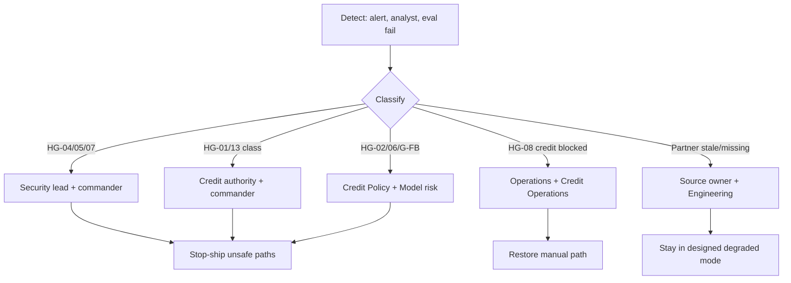

# Incident Response Plan — SME Credit Underwriting Intelligence Workbench

**Compiled:** 2026-09-10  
**CRD IDs:** `CRD-SEC-001`–`012`, `CRD-FR-011`, HG-01–HG-08, G-AUTH-*, G-POL-*, G-FB-*, G-ISO-01, G-RB-01, `FALLBACK-001`, `FEEDBACK-001`  
**Companions:** `artefacts/OPERATIONS_RUNBOOK.md`, `artefacts/SUPPORT_MODEL.md`, `artefacts/DR_STRATEGY.md`, `RELEASE_GATES.md`  
**Status:** Target IR plan. **Not a completed production capability.** Independent production sign-off has not been granted.

**Standing orders (non-negotiable during incidents)**
1. Do not grant `AI_AGENT` final credit, adverse, exception or large-limit authority to recover capacity.
2. Do not fail-open tenant isolation or treat documents as instructions.
3. Do not activate `CREDIT-POLICY-2.9` as rollback.
4. Do not ACK a human decision without a persisted trace.
5. Do not overwrite traces, fixtures or hashes to hide the incident.
6. Hard-gate SLOs have **no error budget**.

Checkpoint questions from the 90-day roadmap — **yes to 1–3 is stop-ship:**
1. Did any screen or workaround bypass `check_access_and_authority` or tenant filters?
2. Did any generated sentence become policy evidence?
3. Did feedback write `CREDIT-POLICY-3.2`, prompts, models or gold labels?

---

## 1. Purpose and scope

Detect, contain, eradicate and recover incidents that affect:

- credit-path continuity (manual underwriting, Human Decision, traces);
- hard gates (authority, policy fidelity, isolation, injection, restricted attributes, fallback);
- source evidence integrity (stale/missing/conflict visibility);
- learning-loop write protection.

Out of scope as “IR success”: restoring the LLM while the case is already workable manually; inventing bureau/bank facts; relaxing GS-08 for a VIP.

---

## 2. Severity

| Sev | Definition | Examples | Credit path | Page |
|---|---|---|---|---|
| **1 — Stop-ship / control breach** | Hard gate failed or will fail if we continue | HG-01 AI ALLOW on final action; HG-04 cross-tenant content; HG-07 injection followed; HG-02 invented threshold applied; HG-05 restricted attrs in runtime; HG-06 v2.9 controlling; G-FB-01 catalog/gold write; HumanDecision ACK without trace | Freeze **assistance** and any unsafe UI path; **keep** manual underwriting if gates still hold | Immediate: Security and/or Policy and/or Credit authority + Operations |
| **1 — Credit path down** | Humans cannot decide with policy/source visible | HG-08 fail (AI down **and** case blocked); both primary and DR trace stores down; IdP deny-all with no break-glass | Restore manual path / trace persist / IAM fail-closed with named break-glass | Operations + Credit Operations |
| **2 — Degraded assistance or partner** | Designed degraded mode; credit path usable | AI outage with fallback working; bureau unavailable (GS-06); bank stale visible (GS-05); policy retrieve out → abstention | Continue with envelopes; no invention | Source owner + Engineering; no need to wake Credit Authority unless limits/adverse stuck |
| **3 — Defect / observability** | Incorrect display, missing probe, TAT mislabelled | Control Tower health missing; 89.5 reported as QT-05 | Correct labelling; do not change gates | Next business period |
| **4 — Request / how-to** | Support, not incident | “How to refer” | `SUPPORT_MODEL.md` | L1 |

When in doubt between Sev 1 control breach and Sev 2, choose **Sev 1**.

---

## 3. Roles

| Role | Who | During incident |
|---|---|---|
| Incident commander | Operations (platform) or Security (HG-04/05/07) | Severity, comms, timeline, stop-ship |
| Credit Operations lead | Credit Operations | Manual path, case queue, no false ACK |
| Policy lead | Credit Policy | Catalog freeze/restore; HG-02/06 |
| Credit authority | `CREDIT_AUTHORITY` | Large-limit / adverse only if engine requires; never via AI |
| Senior underwriter | `SENIOR_UNDERWRITER` | True exceptions only |
| Security lead | Security / privacy | Isolation, injection, IAM, purpose |
| Model risk | Model risk / evals | Model/prompt isolation; G-FB; HG-02 |
| Engineering | Engineering | Gates, adapters, traces |
| Source owner | Per inventory | Partner facts; no invented fill |
| Independent reviewer | Named reviewer | Confirms evidence not rewritten |
| Comms | Credit Operations | Internal: assistance ≠ decision; no production TAT claim |

`AI_AGENT` is **not** on the IR roster.

---

## 4. Escalation paths

| Condition | Escalate within (PROPOSED clock) | Must reach |
|---|---|---|
| Any Sev 1 | Immediate page — clock **OPEN** until Operations names it | Commander + domain lead in table above |
| Sev 2 lasting beyond a named window | **OPEN** | Source owner + Engineering |
| Repeat HG fail on a release | Before next promote | Independent reviewer; do not promote |

Do not escalate by “asking the model to approve.”

**External:** bureau/bank/tax vendors via source owners. **Legal / compliance** for jurisdiction, retention, or data-subject impact — `OPEN_DECISION`, do not invent a regulatory label in the incident ticket.

---

## 5. Detection

| Source | What it catches |
|---|---|
| Control Tower / source health | Partner and AI health |
| Degraded-mode monitor | Wrong class (L006 as L007) |
| Isolation canary (GS-08) | HG-04 |
| Memo/policy fidelity scan | HG-02, GS-14 |
| Trace validator | Missing AT-16; CoT keys; ACK without persist |
| Protected artifact hashes | G-FB-01 |
| Eval suite in CI / release | QT-01 + hard gates on claimed layer |
| Analyst report | GS-04/11/13 class confusion |
| Security logging (when IAM exists) | Authz anomalies |

Contract tests today detect many of these **only in TEST**. UAT/PROD detection is **OPEN** until probes exist.

---

## 6. Response lifecycle

### 6.1 Identify

Record: time, environment (DEV/TEST/UAT/PROD/DR), layer (contract/workbench/production), application ids, tenant, actor role, degraded mode, whether a `HumanDecision` was ACK’d.

### 6.2 Contain

| If | Then |
|---|---|
| Isolation/injection | Block retrieve/display for the unsafe path; **do not** disable filters |
| AI final ALLOW | Disable assistance/handoff that can persist decisions; keep Human Decision |
| Invented policy / v2.9 controlling | Freeze generative memo; restore ACTIVE 3.2 |
| Feedback write | Stop the write path; restore hashes |
| Trace persist fail | Stop ACK |
| AI down | Declare fallback; unstick blocked cases |
| Region loss | `DR_STRATEGY.md` §4.5 |

Preserve applicant documents and traces as evidence.

### 6.3 Eradicate / recover

Follow `OPERATIONS_RUNBOOK.md` §4 and `DR_STRATEGY.md` §4. Re-run the matching golden scenario on the **path users see** before declaring recovered.

### 6.4 Communicate

| Audience | Message |
|---|---|
| Analysts | Manual path status; do not use AI output as policy; engine role still applies |
| Credit authority | Whether large-limit/adverse queues are stalled |
| Exec / demo | Layer honesty: contract ≠ production; no QT-05 from 89.5/142 |
| Applicants | Only via approved recourse; no AI-issued adverse |

### 6.5 Close

- Evidence under a dated incident folder (do not overwrite).
- Traceability/eval notes if a control failed.
- CR if intent or gate must change — specs first.
- High-impact gate changes need human review (`DEFINITION_OF_DONE.md`).
- Post-incident: were Q1–Q3 yes? If yes, promotion stays stopped.

---

## 7. Playbooks (control-plane)

| ID | Trigger | Commander | Recover when |
|---|---|---|---|
| IR-HG01 | AI ALLOW on forbidden action | Credit authority | Gate DENY; GS-02/07/13 pass on claimed layer |
| IR-HG02 | Invented threshold or generated text as policy | Credit Policy | Fidelity scan clean; 3.2 hash expected; GS-14 pass |
| IR-HG04 | Cross-tenant content | Security | GS-08 all families + UI; 0 leaks |
| IR-HG05 | Restricted eval in runtime | Security + Risk/compliance | Sample only in eval zone; GS-03/15 |
| IR-HG06 | v2.9 controlling | Credit Policy | 3.2 controlling; 2.9 historical |
| IR-HG07 | Injection followed | Security | `DOC-009-FIN` class DATA; policy/role unchanged |
| IR-HG08 | AI down and case blocked | Operations | Manual view; policy/source visible |
| IR-FB | Silent learning-loop write | Model risk | Hashes restored; G-FB-01–03 |
| IR-TRACE | ACK without envelope | Credit Operations | Persist-then-ACK; AT-16/17 |
| IR-DR | Site or catalog loss | Operations + Policy | `DR_STRATEGY.md`; never 2.9 |

Assistance-only AI outage with fallback working is **Sev 2**, not IR-HG08.

---

## 8. Evidence and legal hold

- Decision traces, source envelopes, and untrusted documents stay retrievable for reconstructability and approved recourse (`NFR-RET-01`). Calendar **days** remain **OPEN** (Legal).
- Do not purge “embarrassing” injection text or conflicting bank/tax values.
- Restricted fairness data stays out of the underwriting evidence pack.

---

## 9. Readiness criteria for this plan

Production GO still requires drills, not this document.

- [ ] Named incident commander rota (Operations) — **OPEN**
- [ ] Sev 1 page path — **OPEN**
- [ ] GS-10 / HG-08 on **workbench** — OPEN (contract PASS only)
- [ ] G-RB-01 catalog restore — **FAIL**
- [ ] GS-08/09 on UI — OPEN
- [ ] Human override GS-10+02+13 — OPEN on UI
- [ ] Independent reviewer on last Sev 1 — N/A until first drill

**2026-09-10:** Use this plan for workshop/TEST classification. Do not claim a production IR capability.
