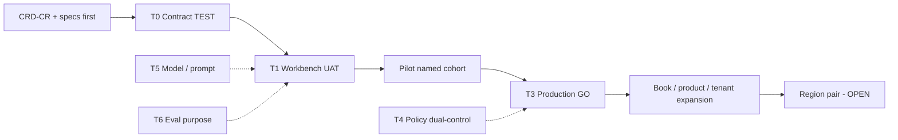

# Release Management Plan — SME Credit Underwriting Intelligence Workbench

**Compiled:** 2026-09-10  
**CRD IDs:** `CRD-BR-003`, `CRD-FR-007`–`011`, `CRD-NFR-002`/`004`/`007`, `CRD-SEC-001`–`012`, HG-01–HG-08, G-UI-01, G-RB-01, G-FB-01–03  
**Companions:** `RELEASE_GATES.md`, `artefacts/ENVIRONMENT_STRATEGY.md`, `artefacts/DR_STRATEGY.md`, `artefacts/CHANGE_CONTROL_PROCESS.md`, `artefacts/GO_LIVE_CHECKLIST.md`, `artefacts/ROLLBACK_PLAYBOOK.md`  
**Status:** Target enterprise release model. **Production GO is BLOCKED.** This file does not authorize live lending, close G-RB-01, or name a cloud region pair (those remain **OPEN**).

**Hard rules**
- Screens display gates; they are not the control plane.
- Feature flags **cannot** disable tenant isolation, authority checks, ACTIVE policy retrieve, persist-before-ACK, or restricted-eval exclusion.
- Fairness/Impact Eval is a **separate purpose**, not a runtime feature flag (`DEPLOYMENT_ARCHITECTURE.md`).
- Rollback of ACTIVE policy is the **previous dual-control ACTIVE** bundle — **never** `CREDIT-POLICY-2.9`.
- Workshop fixtures are never a live credit book (`CRD-NFR-007`).

---

## 1. Release model intent

NexLend promotes **architecture-first assistance**: human credit authority, versioned policy, tenant filters before retrieval, reconstructable traces. Releases are trains of **change classes**, not “ship the chatbot.”

Promotion path remains DEV → TEST → UAT → PROD → DR (`ENVIRONMENT_STRATEGY.md`). A TEST-green CR is not a production GO.

---

## 2. Release trains

Cadence below is **operating intent**. Clock-times that are not in case evidence are **PROPOSED** and do not close GO.

| Train | What rides | Cadence (PROPOSED) | Environments | Strictest class | Exit to next |
|---|---|---|---|---|---|
| **T0 — Contract** | `src/credit_domain`, golden suite, adapter contracts | On merge when tests green | DEV → TEST | A if gates touched; else E | HG-01–HG-08 PASS at contract; fixtures unmodified |
| **T1 — Workbench** | Twelve screens; Human Decision / Trace / Feedback **before** memo UI | After G-UI-01 evidence | TEST → UAT | E + A | G-UI-01; HG re-run on **UI** path |
| **T2 — Assistance** | Memo draft UI, optional LLM, retrieval inspector | Only after T1 memo-prerequisites | UAT then PROD flag | C | GS-09/14/10; `versions.model` honest; HG-08 still true with model killed |
| **T3 — Production adapters** | Named LOS/DOCS/BUREAU/BANK/TAX/EXPOSURE/POLICY/CASE/MEMO | **Once** for first GO; then per adapter CR | UAT → PROD | E + A | `RELEASE_GATES.md` §5.3; fixtures not live book |
| **T4 — Policy catalog** | ACTIVE bundle, AUTH-*, freshness literals | Event-driven; **not** the app train | TEST → PROD catalog | B | Dual-control; GS-12/14; previous ACTIVE retained; **never 2.9** |
| **T5 — Model / prompt** | Model id, system prompt, tool wrapper | Event-driven; may freeze independently | DEV/TEST → UAT → PROD | C | Model risk; GS-09/14; fallback remains |
| **T6 — Evaluation** | Gold labels, suite dimensions, Fairness screen | Event-driven; **separate purpose** | Eval zone only | D | Restricted sample never in runtime; G-FB-* |

**Train coupling**
- T4 does **not** wait for T2. Policy is the authority even if the LLM is off.
- T5 **does** wait for T1 Human Decision. No user-visible memo without the decision/trace/feedback surfaces.
- T6 never shares a runtime flag with T2.
- If a change spans trains, apply the **strictest** class (`CHANGE_CONTROL_PROCESS.md` §3).

**Freeze windows (PROPOSED)**

| Window | Freeze |
|---|---|
| First PROD GO + 30-day hypercare | T5 model/prompt unless Sev 1; T4 only for stop-ship restore |
| Sev 1 control breach | All trains except rollback / IR |
| Policy dual-control in flight | T2 generation optional-off until GS-12 re-verified |

---

## 3. Feature flags

Flags are **rollout and degrade** controls. They are not a substitute for `check_access_and_authority`, `retrieve_active_policy`, or tenant filters.

### 3.1 Allowed flags

| Flag | Default first GO | On means | Off means | Owner |
|---|---|---|---|---|
| `pilot.cohort_allowlist` | **On** (empty = nobody) | Named IdP users / application ids see workbench | All others: Control Tower status or LOS-only | Credit Operations |
| `ui.human_decision` | **On** before any memo | Human Decision screen | Workbench must not emit memo | Engineering + Credit Operations |
| `ui.decision_trace` | **On** with human decision | Trace + ACK after persist | No ACK (`NFR-REC-03`) | Engineering |
| `ui.outcome_feedback` | **On** with human decision | Governed review queue | No `AI_ACCEPTED` write path | Model risk |
| `ui.memo_assist` | **Off** until the three flags above are on | AI-assisted memo UI | Analyst uses manual memo path | Model risk |
| `model.generation` | **Off** until model-risk file | Live LLM behind tools | Stub / `AI_ASSISTANCE_UNAVAILABLE`; HG-08 | Model risk |
| `retrieval.vector` | **Off** until production-shaped index | Vector family (still untrusted DATA) | Lexical/structured/graph only; policy still retrieved | Engineering |
| `retrieval.graph_persist` | **Off** until graph ADR accepted | Persistent graph | In-memory / snapshot; authority still visible | Engineering |
| `ui.failure_simulation` | **On** in UAT; PROD on for trained roles | Failure Lab / degraded drills | Hide from RM | Credit Operations |
| `ui.fairness_eval` | **Off** in underwriting runtime | Fairness screen **only** for `RISK_COMPLIANCE_EVAL` | Screen absent | Risk / compliance eval |
| `rollout.region_dr_promote` | **Off** | DR site serving Human Decision | Primary only | Operations |

Flag state SHALL appear on decision traces (`versions` / tool flags). `NONE` is forbidden if a live model is called.

### 3.2 Forbidden flags (must not exist, or exist only as always-on)

| Control | Why a flag is forbidden |
|---|---|
| Tenant isolation / `DATA-TENANT` | HG-04; VIP “temporary off” is Sev 1 |
| `check_access_and_authority` | Engine role vs LOS (GS-02) |
| ACTIVE policy retrieve | HG-06; generation cannot select 2.9 |
| Restricted eval attributes in runtime | HG-05; **not** a runtime feature flag |
| Persist-before-ACK | Trace RPO 0 |
| AI `APPROVE` / `DECLINE` / large-limit / exception / adverse | HG-01 — not a “pilot convenience” |
| Fail-open on injection | HG-07; documents remain DATA |
| `feedback.write_catalog` | G-FB-01 |

Kill-switch for assistance is `model.generation=off` and/or `ui.memo_assist=off`. Kill-switch is **not** “turn off isolation.”

### 3.3 Flag change control

- Flag flips that expose memo or a live model are **class C** (model risk) plus Credit Operations for cohort.
- Allowlist expansion is **class E/F** with IAM evidence — not a Slack message.
- Audit: who, when, CR id, previous state. `AI_ACCEPTED` cannot flip flags.

---

## 4. Rollout strategies

Always **progressive exposure**. Never big-bang all tenants + live model + memo UI.

| Stage | Strategy | Who / what | Success to proceed |
|---|---|---|---|
| **R0 Dark** | Deploy gates + Human Decision to UAT with `ui.memo_assist=off` | Designated UAT IdP group | G-UI-01; HG on UI; GS-10 manual path |
| **R1 Supervised UAT** | Failure Lab + golden L001/L005/L011 | Named cohort (`TRAINING_PLAN.md`) | BM-A01 = 100% of that cohort |
| **R2 Unsupervised UAT** | Same flags; L1 shadow | Same cohort | No Sev 1 from process; bypass tickets coaching-only |
| **R3 Production pilot** | `pilot.cohort_allowlist` on a **named production book**; `model.generation` optional | Signed roles only; live adapters | `GO_LIVE_CHECKLIST.md`; G-RB-01 done |
| **R4 Hypercare** | 30 days (`ADOPTION_STRATEGY.md`); T5 frozen unless Sev 1 | Pilot book | HG green; honesty strip labelled |
| **R5 Expand cohort** | More analysts / authority users; still one book | Allowlist CR | In-workbench completion; no shadow GPT |
| **R6 Expand book / product** | Additional facilities in existing NexLend products | New allowlist + adapter confirmation | Same HG; QT-05 **not** required to expand if still labelled NOT PROVEN |
| **R7 Tenant expansion** | Additional production tenants under prod IAM | Isolation canary per tenant pair | HG-04 = 0 on canary; workshop ALPHA/BETA is **not** the design |
| **R8 Region** | DR promote drill then optional second region | Operations-named pair | Isolation on DR; regional RTO **named** (today OPEN) |

**Canary meaning here:** synthetic GS-08 isolation probe and Human Decision synthetic — **not** a percentage of live credit decided by AI.

**Blue/green / rolling:** allowed for **stateless UI** behind the same control plane. ACTIVE catalog and trace store are **not** blue/green’d onto v2.9 or onto an empty trace replica.

---

## 5. Rollback strategies (summary)

Full procedures: `ROLLBACK_PLAYBOOK.md`. DR site loss: `DR_STRATEGY.md`. IR: `INCIDENT_RESPONSE_PLAN.md`.

| Failed thing | First action | Must not |
|---|---|---|
| Live model / prompt | `model.generation=off`; keep Human Decision | Wait for LLM; fabricate memos |
| Memo UI defect | `ui.memo_assist=off` | Hide Human Decision |
| Bad workbench build | Redeploy last signed SHA; same policy hash | Skip isolation to “get users in” |
| Bad ACTIVE promote | Restore **previous ACTIVE**; G-RB-01 | Activate 2.9 |
| Adapter poison / wrong book | Disable that adapter; null envelope; abstain | Invent bureau/bank; use fixtures as live |
| Isolation/injection fail | Stop-ship unsafe retrieval; fail-**closed** | Fail-open; DR to a looser site |
| Trace persist fail | Do not ACK | Confirm decision in chat |

G-RB-01 is the **catalog restore drill**. It is **OPEN** and **blocks** first T3 GO.

---

## 6. Pilot execution

Pilot is **R3–R4**, not a workshop demo and not org-wide rollout.

### 6.1 Entry (all required)

- [ ] G-UI-01 evidenced; Human Decision / Trace / Feedback before memo
- [ ] HG-01–HG-08 PASS on the **workbench** path
- [ ] G-FB-01–03 green
- [ ] G-RB-01 drill recorded; rollback controller ≠ 2.9
- [ ] Named production adapters; fixtures forbidden as live book
- [ ] Named IdP groups = role matrix (not “everyone is analyst”)
- [ ] Named **production book** id and uncomplicated-case definition (Credit Operations)
- [ ] Failure Lab 100% of pilot users (GS-08/09/10/14 + identity/missing-bureau)
- [ ] Hypercare rota named (clocks were OPEN until Operations names them)
- [ ] Independent reviewer + sign-off families (`RELEASE_GATES.md` §6)

### 6.2 During pilot

| Do | Do not |
|---|---|
| Complete cases in workbench; persist `HumanDecision` | Side chatbot with application PDFs |
| Leave stale/missing/conflict visible | Clear defects to hit TAT |
| Engine `required_human_role` | LOS title as authority |
| `GOVERNED_REVIEW` for AI accept/modify/reject | Write catalog from `AI_ACCEPTED` |
| Label TAT population on any chart | Report 89.5 or 142 as QT-05 |
| Isolation canary continuous | Waive HG-04 for a VIP or second tenant |

### 6.3 Exit / expand / abort

| Outcome | Criteria |
|---|---|
| **Expand (R5)** | No Sev 1 control breach; BM-A05 shadow incidents = 0 material; HG window green; allowlist CR |
| **Hold** | How-to ticket volume high but gates green; extend hypercare |
| **Abort (rollback)** | Any HG fail; G-FB-01; isolation/injection; invented threshold treated as policy; credit path down **and** manual path not executable |

Pilot success is **gated completion**, not memo volume. SM-01 / QT-05 may stay **NOT PROVEN** through the whole pilot.

---

## 7. Market expansion

“Market” here means **additional NexLend underwriting exposure** under the same hard gates — not a new licence, country, or legal fairness regime. Jurisdiction and DPIA remain `OPEN_DECISION` / residual in `PRODUCTION_READINESS_REVIEW.md`.

| Expansion type | Allowed when | Still forbidden |
|---|---|---|
| More users in the **same** book | R5 allowlist CR; training current | RM taking decisions |
| Additional **book** (same products: working-capital, invoice-finance, term-loan as already in product scope) | Named adapters + source owners; same ACTIVE 3.2 unless T4 CR | Fixtures as that book |
| Additional **tenant** (prod IAM) | HG-04 canary on the new pair; purpose tokens scoped | Workshop ALPHA/BETA as the IAM design; shared vector index without tenant filter |
| Eval / fairness cohort | Separate purpose zone; de-identified or approved sample | Restricted attrs as runtime features or “expansion KPIs” |
| New product type or new credit threshold | **Class A/B CR** + spec first | Prompt-only new INR cut-off |
| New geography / regulatory label | Qualified Legal/compliance CR only | Inventing a sector-wide label in a release notes |

Each expansion re-runs the honesty strip (`EXECUTIVE_DASHBOARD_SPEC.md` §4). Value clock rules in `VALUE_REALIZATION_FRAMEWORK.md` still apply: HG first; do not mix TAT populations.

---

## 8. Multi-region deployment

Cloud **vendor, region pair, and instance sizes are OPEN** (`DEPLOYMENT_ARCHITECTURE.md`). This section is the **pattern**, not a named AWS/GCP map.

### 8.1 Pattern (first GO)

| Mode | Status | Behaviour |
|---|---|---|
| **Single primary + DR replica** | Required before GO (G-RB-01 + regional table-top or drill) | Replicate traces, HumanDecision, ACTIVE catalog, IAM, adapter config. LLM optional on DR. |
| **Active-active workbench** | **Not claimed** | Would still require tenant filters and the same ACTIVE hash in every region; do not ship this to “make GO.” |
| **Partner regions** | Owned by LOS/bureau/bank | Workbench follows surviving sources; null envelope if a partner region is dark |

Regional RTO for UI is **OPEN** until Operations names it. Credit-path RTO when **AI** is down is already **0 extra wait** (manual fallback) and does **not** require a second region.

### 8.2 Invariants on every region

1. Isolation **before** retrieval and display (HG-04).
2. Engine role, not LOS assignment (G-AUTH-03).
3. ACTIVE = dual-control bundle; 2.9 reference-only.
4. Restricted eval store **not** routable from underwriting runtime.
5. ACK `HumanDecision` only after trace persist (RPO 0).
6. Failover does not fail-open and does not grant AI credit.

### 8.3 Expansion to a second active region (later CR)

Only after: named pair, named RTO, isolation canary in both, catalog hash match, G-RB-01 failback tested, independent reviewer. Traffic shift is Operations-declared — not a model router.

---

## 9. Version identity on every release

Each promoted build records (`ENVIRONMENT_STRATEGY.md` §7.4):

- git SHA  
- policy catalog version (`CREDIT-POLICY-3.2` + content hash)  
- semantic / ontology version  
- prompt / model versions (`NONE` only if unused)  
- eval report id  
- flag snapshot  

Decision traces copy those versions (`CRD-FR-009`). Do not overwrite prior `evidence/sdd/` to make a train look green.

---

## 10. Current release state (2026-09-10)

| Train | State |
|---|---|
| T0 Contract | TEST operable; GS-01–GS-15 / HG contract PASS |
| T1 Workbench | **BLOCKED** (0/12; G-UI-01 OPEN) |
| T2 Assistance | **Not started** (`versions.model=NONE`) |
| T3 Production | **BLOCKED** (§5.3) |
| T4 Policy | Workshop ACTIVE 3.2; production dual-control **NOT PROVEN** |
| T5 Model/prompt | No live PROD model |
| T6 Eval | Contract G-FB PASS; eval UI OPEN |
| Pilot / market / multi-region | **Not started**; region pair OPEN; G-RB-01 FAIL |

Do not announce an enterprise release train as running while T1 is blocked.
