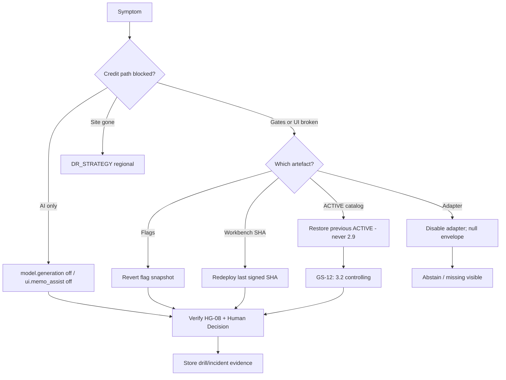

# Rollback Playbook — SME Credit Underwriting Intelligence Workbench

**Compiled:** 2026-09-10  
**CRD IDs:** HG-01–HG-08, G-RB-01, G-POL-01, `FALLBACK-001`, `FEEDBACK-001`, NFR-REC-01–03  
**Companions:** `artefacts/RELEASE_MANAGEMENT_PLAN.md`, `artefacts/GO_LIVE_CHECKLIST.md`, `artefacts/DR_STRATEGY.md`, `artefacts/INCIDENT_RESPONSE_PLAN.md`, `RELEASE_GATES.md`  
**Status:** Target playbook. **G-RB-01 is OPEN (FAIL) and blocks production.** This file is not a completed drill.

**Hard rule:** Superseded `CREDIT-POLICY-2.9` is **never** a production, DR, or release-rollback controller.

---

## 1. Purpose

Undo a **bad release** (build, flag, model, prompt, adapter, or ACTIVE catalog) while keeping **human underwriting**, **tenant isolation**, and **reconstructable traces**.

This is not the same as:

| Situation | Use instead |
|---|---|
| AI / vector down, credit path still usable | Degraded mode — `DR_STRATEGY.md` §4.1; **do not** rollback the workbench |
| Bureau/bank partner down | Null envelope — §4.2 there |
| Primary **region** lost | DR failover — §4.5 there |
| Isolation/injection already succeeded | IR stop-ship — **fail-closed**, not “rollback to looser flags” |

Standing orders match IR: no AI-final to recover capacity; no fail-open; no ACK without persist; do not overwrite traces to hide the event.

---

## 2. Decide: kill-switch vs rollback vs DR

**Default first action for assistance defects:** turn **off** generation — faster than a build rollback, and the credit path must already work without the LLM (HG-08).

---

## 3. Roles

| Role | Rollback authority |
|---|---|
| Incident commander (Operations or Security) | Declares rollback vs stop-ship vs DR |
| Credit Policy | Catalog restore; **veto** any 2.9 activate |
| Operations | Redeploy SHA; DR promote; flag infra |
| Engineering | Flag snapshot, adapter disable, trace health |
| Model risk | `model.generation` / prompt version pin |
| Credit Operations | Manual queue; no fabricated memos; no false ACK |
| Credit authority / Senior UW | Engine-required actions on the surviving path |
| Security | Isolation/injection: fail-closed; no “rollback isolation off” |
| Independent reviewer | Confirms evidence vs this playbook |

`AI_AGENT` / `AI_ACCEPTED` cannot approve a rollback.

---

## 4. Pre-conditions (what must already exist)

Without these, you cannot complete G-RB-01 — and **must not** GO live.

- [ ] Immutable last **signed** workbench SHA + artefact hashes
- [ ] Dual-control **previous ACTIVE** bundle + content hash (3.2 lineage, not 2.9)
- [ ] Flag snapshot at GO (`GO_LIVE_CHECKLIST.md` §8)
- [ ] Model/prompt ids recorded (`NONE` if unused)
- [ ] Trace store writable or known fail-closed behaviour (no ACK)
- [ ] Manual underwriting view independently reachable
- [ ] This playbook’s owners named

**2026-09-10:** drill **not** executed.

---

## 5. Play: assistance / model / prompt (T5)

**Triggers:** HG-02 in live memos; GS-09 followed; fluent invented thresholds; model outage already covered by fallback but generation is harmful.

| Step | Action | Verify |
|---|---|---|
| 1 | `model.generation=off` (and `ui.memo_assist=off` if UI still offers a fake-complete memo) | Flag audit; traces show generation unused |
| 2 | Keep Human Decision, policy 3.2, source health | Analysts can finish GS-10 class cases |
| 3 | Deny fabricated “catch-up” AI memos | HG-08 |
| 4 | Pin prompt/model to last signed id **or** remain off | `versions.*` honest |
| 5 | GOVERNED_REVIEW any `AI_ACCEPTED` from the bad window — **no catalog write** | G-FB-01 |
| 6 | Model-risk CR before generation returns | GS-09/14/10 re-run |

**Rollback of model is not** “use an older policy.” Policy stays ACTIVE 3.2 unless §7 applies.

---

## 6. Play: workbench build / flags (T1–T2)

**Triggers:** UI bypasses a gate; memo visible without Human Decision; ACK without persist; cohort allowlist leaked.

| Step | Action | Verify |
|---|---|---|
| 1 | If a **forbidden** flag was turned off (isolation, authority, policy retrieve): **stop-ship** — restore **on**; this is Sev 1, not a quiet flag tweak | HG-04/01/06 |
| 2 | Else restore **GO flag snapshot** | Allowlist, memo, generation match last signed |
| 3 | If snapshot is insufficient: redeploy **last signed SHA** (blue/green UI allowed; same control plane) | Git SHA on honesty strip |
| 4 | Do not ACK in-flight decisions if trace schema broke — fail persist, leave pending | NFR-REC-03 |
| 5 | Re-run HG on UI path before re-opening `ui.memo_assist` | Workbench QT-01 not claimed from contract |

**Do not** roll UI back to a build that lacked Human Decision/Trace/Feedback in order to “restore memo.”

---

## 7. Play: ACTIVE policy catalog (T4) — G-RB-01

**Triggers:** Bad ACTIVE promote; catalog corruption; HG-06 (superseded/wrong bundle controlling).

| Step | Action | Verify |
|---|---|---|
| 1 | Freeze **generation** if memos could cite the bad bundle; **manual path stays up** | HG-08 |
| 2 | Restore **previous ACTIVE** from dual-control history | Content hash match |
| 3 | **Never** set `CREDIT-POLICY-2.9` to `controlling=true` | G-POL-01 |
| 4 | Re-run GS-12 class: current ACTIVE controlling; v2.9 `controlling=false` | HG-06 = 0 |
| 5 | Re-run GS-14: invented extras still rejected; known literals only those in the restored bundle | HG-02 |
| 6 | Feedback path remains write-protected | G-FB-01 |
| 7 | Record drill/incident evidence; do not overwrite the failed promote’s hash record | Provenance of the mistake stays |

If the only stored “previous” were 2.9, **do not GO** until a dual-control previous-ACTIVE of the 3.2 lineage exists. Lack of that artefact is a **GO blocker**, not an excuse to activate 2.9.

---

## 8. Play: adapter / data

**Triggers:** Adapter pointing at fixtures in PROD; wrong tenant mapping; partner payload treated as instructions.

| Step | Action | Verify |
|---|---|---|
| 1 | Disable the offending adapter | Null envelope / `MANDATORY_ABSTENTION` as designed |
| 2 | Do not invent bureau, bank, or policy facts | GS-06 / NFR-REL-03 |
| 3 | Missing bureau ≠ exception (GS-06 ≠ GS-07) | SM-08 split |
| 4 | If tenant mapping wrong: fail-closed retrieval; Security Sev 1 | HG-04 |
| 5 | If injection followed: IR §4.6 — preserve traces; do not wipe | HG-07 |
| 6 | Re-point to named production adapter only after CR | Fixtures still not live book |

---

## 9. Play: isolation / injection / restricted eval (do not “roll back open”)

These are **not** recovered by redeploying a friendlier build.

1. Deny traffic on the unsafe path; keep fail-**closed**.
2. Preserve traces (do not erase inconvenient retrievals).
3. Rotate purpose tokens if leakage suspected.
4. Confirm restricted eval sample is not on the runtime network.
5. Re-run GS-08 / GS-09 / GS-03 before any resume.
6. Independent reviewer signs resume.

Rolling **back** a filter is forbidden. Rolling **forward** a fix is a class A CR.

---

## 10. Play: trace / HumanDecision persist

1. **Do not ACK** if the trace store cannot persist.
2. Leave the case pending; do not confirm in chat or email as the system of record.
3. Fail over trace replica only if the store is the fault (`DR_STRATEGY.md` §4.3).
4. Replay must not invent missing portfolio outcomes (G-FB-02).

---

## 11. Drill script (closes G-RB-01 when evidenced)

Execute in UAT **before** first PROD GO; repeat on PROD-shaped catalog with non-live data if required by Operations. Store a dated report; do not overwrite.

| # | Drill | Pass |
|---|---|---|
| D1 | Kill `model.generation`; complete a large-limit-shaped case **manually**; still requires `CREDIT_AUTHORITY` | HG-08 + GS-02 class |
| D2 | Restore GO flag snapshot after an intentional bad `ui.memo_assist=on` without Human Decision | Memo hidden; HD remains |
| D3 | Redeploy previous signed SHA | Honesty strip SHA; isolation still on |
| D4 | Promote a **dummy** ACTIVE then restore previous 3.2 hash; confirm 2.9 never controlling | **This is G-RB-01** |
| D5 | Disable bureau adapter; null envelope; not GS-07 | GS-06 |
| D6 | Trace write fail → no ACK | NFR-REC-03 |
| D7 | Table-top or live: DR promote; GS-08 on DR; failback hashes | Regional OPEN until RTO named |

**Pass rule:** D4 **must** pass or production GO stays **BLOCKED**. D1 must pass on the **workbench** path before memo GO.

---

## 12. Communication during rollback

| Audience | Message |
|---|---|
| Analysts | Manual path is the credit path; do not paste documents into a chatbot; do not invent policy |
| Authority | You remain mandatory; AI cannot cover GS-02/07/13 |
| Exec | Assistance rolled back or off; **not** “we rolled policy to 2.9”; TAT not QT-05 |
| Support L1 | No ticket to disable isolation or “just approve” |

Forbidden: “Use 2.9 until 3.2 is fixed.” “Ignore the injection warning for this VIP.”

---

## 13. Resume criteria

Resume generation or memo UI only when:

- [ ] Failed artefact identified; CR filed if intent/policy/model changes
- [ ] HG-01–HG-08 green on the **claimed** layer
- [ ] G-FB-01 still green
- [ ] Flag snapshot + SHA + policy hash recorded
- [ ] Independent reviewer (control incidents) or Credit Operations (assistance-only kill-switch) signs

Resume is a **new** promotion, not an automatic fail-forward.

---

## 14. Evidence pack (each rollback or drill)

- Timeline (detect → decide → action → verify)
- SHA / policy hash / flag JSON before and after
- HG/GS ids re-run
- Confirmation **2.9 not controlling**
- Human actions (who approved rollback)
- Links to traces (no CoT dumps)
- Whether GO remains blocked

---

## 15. Readiness (2026-09-10)

| Item | State |
|---|---|
| Playbook text | This file |
| Owners named | **OPEN** |
| D1 workbench | **OPEN** (0/12 screens) |
| D4 G-RB-01 | **FAIL** — blocks PROD |
| Regional D7 | **NOT PROVEN**; RTO OPEN |

Until D4 is evidenced, do not treat rollback as a production capability.
