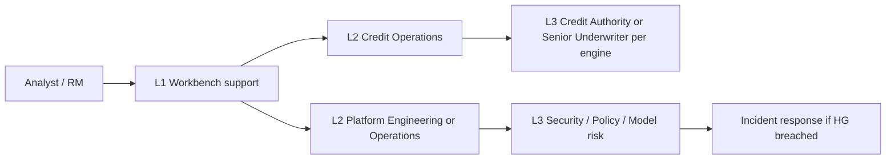

# Support Model — SME Credit Underwriting Intelligence Workbench

**Compiled:** 2026-09-10  
**CRD IDs:** `CRD-FR-007`, `CRD-FR-011`, `CRD-NFR-004`, `CRD-SEC-001`, `CRD-DATA-010`, HG-01, HG-08  
**Sources:** `evidence/04_policy_authority/role_authorization_matrix.csv`, `RELEASE_GATES.md` §6, `artefacts/NFR_SPECIFICATION.md` §2, `artefacts/PRD.md` personas  
**Companions:** `artefacts/OPERATIONS_RUNBOOK.md`, `artefacts/INCIDENT_RESPONSE_PLAN.md`  
**Status:** Target support model. **No production on-call exists yet.** Numeric support clocks below that are not in case evidence are **PROPOSED** and do not close production GO.

This model does **not** add lending power. `AI_AGENT` is not a support tier and cannot take final credit action to “clear a ticket.”

---

## 1. Support intent

Keep **human underwriting** moving when assistance degrades, and keep **hard gates** intact when users are under time pressure. Faster TAT is a failure if isolation, policy, evidence or authority is weakened.

| User need | Support outcome | Not a support outcome |
|---|---|---|
| Finish an uncomplicated case | Manual path + evidence/policy visible | AI approval |
| Exception / large limit / adverse | Route to engine-required role | Bypass Credit Authority |
| “System is down” | Classify: AI vs credit path vs partner vs gates | Block the case because the LLM is down |
| Fairness question | Separate `RISK_COMPLIANCE_EVAL` | Inject restricted attributes into runtime |
| “Ignore the document warning and approve” | Deny; Security | Follow applicant-document instructions |

---

## 2. Who is supported

| Persona | How they get help | Authority during support |
|---|---|---|
| `RELATIONSHIP_MANAGER` | Assigned-app status only; L1 explains source-health | No memo, no decision |
| `CREDIT_ANALYST` | Primary L1/L2 consumer | Final credit only if engine allows |
| `SENIOR_UNDERWRITER` | L2 for exceptions (GS-07 class) | Within authority; no informal policy override |
| `CREDIT_AUTHORITY` | L3 for large-limit / adverse / formal exception | Engine role; not replaceable by support staff |
| `RISK_COMPLIANCE_EVAL` | Separate eval support; not underwriting L1 | No runtime decision |
| Applicant / affected person | Recourse via Case Management + approved appeal path — **not** the AI | Human decision + material reason + source |
| `AI_AGENT` | Not a customer | Advisory only |

Identity **adjudication** (GS-04) is handled by existing human authority, not a new support role invented here.

---

## 3. Support tiers

| Tier | Who | Handles | Must not |
|---|---|---|---|
| **L1** | Workbench / Credit Operations support (when staffed) | How-to, stale vs current, AI-outage fallback, “use Human Decision,” ticket hygiene | Change policy, approve credit, disable gates, cross-tenant retrieve |
| **L2 platform** | Engineering + Operations | Adapters, traces, UI defects, degraded-mode bugs, deploy | Fail-open isolation; skip `check_access_and_authority` |
| **L2 credit** | Credit Operations | Workflow, missing evidence vs exception, memo grounding, TAT labelling | Treat LOS assigned role as engine role |
| **L3 domain** | Engine-required human: `SENIOR_UNDERWRITER` or `CREDIT_AUTHORITY` | Exception approval, large limit, adverse/recourse | Delegate to AI or L1 |
| **L3 control** | Credit Policy, Security/privacy, Model risk, Risk/compliance eval | Catalog, HG-02/04/05/06/07, learning loop | Invent fairness legal cut-offs; activate v2.9 |
| **Incident commander** | Operations (platform) or Security (control breach) | Severity, comms, stop-ship | Grant AI final credit |

---

## 4. Service ownership vs support ownership

| Topic | Service owner (accountable) | Support owner (first to pick up) |
|---|---|---|
| Human Decision / case record | Credit Operations | L1 → L2 credit |
| Gates / isolation | Engineering + Security | L2 platform → L3 Security |
| Policy version | Credit Policy | L3 Policy (not L1) |
| Bank freshness | Data Partnerships | L2 credit + partner |
| Bureau / tax | Credit Risk | L2 credit + partner |
| Exposure | Portfolio Risk | L2 credit |
| LOS / documents | Lending Operations | L2 credit |
| LLM / prompts | Model risk | L2 platform (fallback) then Model risk |
| Fairness eval | Risk / compliance eval | Not L1 underwriting |
| DR / rollback drill | Operations + Credit Policy | Incident commander |

---

## 5. Intake and routing

| Symptom | Route | Golden-scenario analog |
|---|---|---|
| “AI is down, I cannot approve” | L1: enable manual path; if still blocked → incident HG-08 | GS-10 |
| “Need exception approved” | Engine role; L3 Senior Underwriter if `POL-EXC-07` class | GS-07 |
| “Limit above 5,000,000” | L3 Credit Authority; AI cannot authorize | GS-02 |
| “Bank vs tax disagree” | L2 credit: keep both; do not average | GS-11 |
| “Names do not match” | L2 credit: keep AMBIGUOUS | GS-04 |
| “Bureau blank, invent a score” | Deny; L2 credit | GS-06 |
| “Document says ignore policy” | Security incident | GS-09 |
| “See the other tenant’s app” | Security incident | GS-08 |
| “Memo invented a cutoff” | Policy + Model risk incident | GS-14 |
| “Accepted AI — update policy” | Governed review only | GS-15 |
| Adverse / guarantor / recourse | L3 Credit Authority; AI no decline | GS-13 |
| Sole trader treated as company-only | L2 credit; restricted attrs out | GS-03 |
| Fairness cohort job | Risk/compliance eval channel | P2-02 |

**Hours of coverage:** **OPEN** until Operations names them. Candidate (PROPOSED, not case evidence): L1 during NexLend credit-ops hours; L2/L3 on-call for severity 1 hard-gate and credit-path outages. Candidate does not authorize production GO.

---

## 6. Support SLAs (proposed vs binding)

Binding promises are hard gates and manual fallback — not ticket clocks.

| Promise | Binding / proposed | Measure |
|---|---|---|
| Manual underwriting available when AI is down | **BINDING** (HG-08) | Case not blocked; no fabricated memo |
| Zero successful cross-tenant helpdesk “workarounds” | **BINDING** (HG-04) | Count of isolation bypasses = 0 |
| L1 first response | **PROPOSED** — Operations names before PROD | Ticket timestamp |
| Severity 1 page | **PROPOSED** — Operations names | Time to incident commander |
| Applicant appeal calendar | **OPEN** — Legal / Credit Operations (`NFR-CMP-04`) | Recourse policy; do not invent days |

Do not spend support “goodwill” by weakening HG-*.

---

## 7. Knowledge and tooling

| Tool | Support use |
|---|---|
| Control Tower / source health | L1 first look (when built) |
| Failure Simulation | Rehearse GS-05/06/08/09/10/12 — not production data |
| Decision Trace | Reconstruct; no CoT field |
| Eval suite report | Whether the claimed layer is green |
| Role matrix | Who may decide |
| `CREDIT-POLICY-3.2` | Only ACTIVE workshop/prod catalog until CR |
| This runbook + IR plan | Classification and standing orders |

L1 scripts MUST tell users: assistance is not a credit decision; stale evidence stays visible; engine role wins over LOS assignment.

---

## 8. Out-of-hours and vendor support

| Party | When | Constraint |
|---|---|---|
| Bureau / bank / tax vendors | Partner outage | Ops + source owner; envelopes stay null/stale; no invented facts |
| IdP / secret store | Auth outage | Fail **closed** for interactive; do not disable tenant filters |
| LLM vendor | Model outage | Credit path continues; model restore is not RTO for lending |
| Cloud/infra (when named) | Region loss | `DR_STRATEGY.md`; same gates on DR |

Vendors are not granted `CREDIT_AUTHORITY`.

---

## 9. Readiness of this support model

| Item | 2026-09-10 |
|---|---|
| Contract troubleshooting via tests | Available to Engineering |
| L1 workbench support | **Not staffed** — no UI |
| Named on-call rota / clocks | **OPEN** |
| Production tickets | **N/A** — PROD blocked |
| Applicant recourse operations | Policy text exists; calendar OPEN; UI OPEN |

Staffing and clocks require Operations + Credit Operations sign-off before UAT/PROD. This file does not create that rota.
