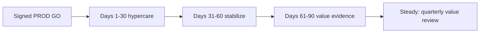

# Value Realization Framework — SME Credit Underwriting Intelligence Workbench

**Compiled:** 2026-09-10  
**CRD IDs:** `CRD-BR-001`–`004`, `CRD-NFR-001`–`007`, HG-01–HG-08, QT-01–QT-05, G-UI-01, G-RB-01  
**Companions:** `artefacts/BUSINESS_METRICS_CATALOG.md`, `artefacts/EXECUTIVE_DASHBOARD_SPEC.md`, `artefacts/SUCCESS_METRICS.md`, `artefacts/ADOPTION_STRATEGY.md`  
**Status:** How NexLend would measure business value **after a signed production go-live**. This file does **not** authorize go-live. Production GO remains **BLOCKED**. No SM-01 / QT-05 or operating-baseline reduction is proven.

**Normative rule:** Hard domain-control gates pass **first**. Usefulness, latency, burden reduction and recommendation quality are judged only after those invariants (`specs/00_product/PRD.md` success model). Faster TAT is failure if HG-* degrade.

---

## 1. When value may be claimed

| Condition | Required |
|---|---|
| Environment | Named **PROD** population with live (or production-shaped) adapters — not the 15 golden apps, not the 160-row fixture |
| Product surface | Twelve workbench screens displaying P0/P1 state (G-UI-01) **and** Human Decision before any user-visible memo |
| Controls | HG-01–HG-08 PASS on the **workbench/production path** in the same window as the value claim |
| Rollback | G-RB-01 drill complete; rollback controller is never `CREDIT-POLICY-2.9` |
| Population label | Every TAT / productivity tile names: source baseline **142** / workshop **89.5** / golden 15 / **this production book** |
| Human sign-off | Independent reviewer + Credit Operations on high-impact claims (`RELEASE_GATES.md` §5.3) |

Until those hold, the only honest statement is: **contract-layer gates exist; operating value is not realized.**

---

## 2. Value thesis

The workbench creates value if designated humans complete underwriting **in** a provenance-bearing, policy-version-aware context, with AI as assistance, and with reconstructable traces — **without** fabricating certainty or granting the model credit authority.

| Value stream | Business objective | Realized when | Not realized by |
|---|---|---|---|
| **Control integrity** | `CRD-BR-003` | HG-01–HG-08 remain 0 / 100% / true on the live path | Prompt obedience; workshop 15/15 PASS |
| **Trustworthy context** | `CRD-BR-002` | Material FACT statements have provenance; bank / tax / statement revenue stay distinct; stale / missing / conflict stay visible | Dumping PDFs into a chatbot |
| **Reconstructability** | `CRD-BR-004` | AT-16 fields persist; no hidden CoT as audit evidence; `HumanDecision` is the decision | Memo volume; fluent narrative |
| **Cycle time** | `CRD-BR-001` / QT-05 | Uncomplicated TAT **< 30 min** on the **named production** book **and** HG still pass | Reporting 89.5 or 142 as the target |

Source-case baseline (`source_case_baseline.json`) frames the **operating problem**. It is not a result already achieved:

| Baseline (source case) | Role in value |
|---|---|
| Median TAT 142 min / P90 648 | Problem framing; comparison **only** vs a named production book |
| Document rework 31.2% | SM-07 direction |
| >3 manual lookups 57% | SM-06 direction |
| Median memo 38 min | SM-05 direction — **without** invented facts |
| Policy-rule exceptions 8.4% | Incidence, **not** a KPI to shrink by bypassing GS-07 |
| Missing source reference 13.7% | SM-02 / HG-03 on the UI path |

---

## 3. Realization stages (post go-live)

Do not start this clock before §5.3 GO. Hypercare clocks in `SUPPORT_MODEL.md` remain **OPEN** until Operations names them.

| Stage | What is measured | What may be claimed |
|---|---|---|
| **Days 1–30** | Adoption hygiene, HG-*, Sev 1, Failure Lab coverage, path completeness | “Users complete cases in the workbench without gate bypass.” **No** TAT <30 claim |
| **Days 31–60** | SM-05 / SM-06 / SM-07 samples vs **source** baseline; SM-08 split holds | Directional productivity **if** HG green. Still **not** QT-05 unless the production book is named and <30 |
| **Days 61–90** | SM-01 on named uncomplicated production population; provenance vs 13.7% | QT-05 **only** if median <30 **and** HG intact **and** population ≠ 142 ≠ 89.5 |
| **Steady** | Same pack + financial conversion **if** Finance CR names a rate; credit-book P&L stays out of this product’s authority | Quarterly steerco; stop-ship if HG regress |

Workshop contract 15/15 does **not** start this clock.

---

## 4. Measurement families

Detail and formulas: `BUSINESS_METRICS_CATALOG.md`. Dashboards: `EXECUTIVE_DASHBOARD_SPEC.md`.

| Family | Question | Leading | Lagging |
|---|---|---|---|
| **Adoption** | Are designated roles doing the work **in** the workbench, with gates intact? | Failure Lab, bypass tickets, shadow-tool incidents | Share of assigned cases completed in-workbench |
| **Decision quality** | Are recommendations grounded, authorized, and reconstructable? | HG-01/02/03/06; G-AUTH-*; L006≠L007 | Provenance coverage vs 13.7%; human modify/reject of invented content |
| **Productivity** | Did burden fall without fabricating facts? | Path time-to-grounded-memo | SM-05/06/07; SM-01 only on named book |
| **Financial outcomes** | Can hours and control incidents be converted without inventing P&L? | Hour and incident **counts** | $ conversion **OPEN** until Finance names a rate; **no** NPL/loss-ratio claim from AI |
| **User engagement** | Are users following the gated path, not a side chatbot? | Screen-path completion, time-to-first Human Decision | Sustained in-workbench completion; RM not taking decisions |
| **Risk reduction** | Did isolation, injection, restricted-eval, and policy-version failures stay at zero? | HG-04/05/07/08; G-FB-01 | Sev 1 trend; audit source-ref; catalog-write attempts = 0 |

---

## 5. Attribution rules

1. **Name the layer** (contract / workbench / production) on every number.
2. **Name the population.** Mixing 142, 89.5, golden 15, and production is a reporting defect (`CRD-NFR-007`).
3. **Same-window gates.** A productivity win in a week where HG-02 or HG-04 fails is **not** value; it is a control incident.
4. **No shadow credit.** Cases completed in ChatGPT / spreadsheets that blend bank and tax **do not** count as adopted or as TAT.
5. **Engine role wins.** LOS assignment does not attribute a large-limit or adverse outcome to the workbench if the engine required `CREDIT_AUTHORITY` and the actor was insufficient (GS-02).
6. **Feedback is not gold.** `AI_ACCEPTED` and portfolio outcomes do not rewrite policy, ontology, prompts, models, or gold (G-FB-01). They are not default prediction labels.
7. **Fairness is not a cutoff KPI.** Cohort diagnostics remain `RISK_COMPLIANCE_EVAL` purpose. Do not invent a legal fairness threshold or score “fairness improvement” as value.
8. **Exceptions are not waste.** Reducing 8.4% by collapsing missing bureau (L006) into exception (L007) is **anti-value**.
9. **Hours before money.** Convert analyst minutes only after SM-05/06/07 are measured on the named book. Currency rates, fully loaded FTE cost, and expected-loss models are **not** in case evidence — leave **OPEN**.
10. **Independent challenge.** Credit Operations measures; independent reviewer challenges TAT labelling and gate windows.

---

## 6. Stop-ship for value campaigns

Value reporting and TAT bonuses **pause** if any of the following is true in the claim window:

| Trigger | Why |
|---|---|
| Any HG-01–HG-08 fail on the claimed layer | Control integrity is the first value stream |
| G-FB-01: catalog/prompt/model/gold write from `AI_ACCEPTED` | Learning loop corruption |
| Tenant isolation or injection followed | HG-04 / HG-07 |
| Invented threshold in a memo treated as policy | HG-02 critical |
| Fixture or source TAT presented as QT-05 | Reporting integrity (`R-OPS-04`) |
| Restricted eval attributes in runtime context | HG-05 |
| AI outage with fabricated assistance memo | HG-08 / GS-10 |

---

## 7. Governance of the value pack

| Activity | Accountable | Responsible | Consulted |
|---|---|---|---|
| Define / change a BM-* metric | Credit Operations | Engineering (instrumentation) | Independent reviewer, Model risk |
| Convert hours to currency | Finance (**OPEN** until named) | Credit Operations | Sponsors |
| Claim QT-05 / SM-01 | Independent reviewer | Credit Operations | Credit Policy, Engineering |
| HG traffic lights | Model risk + Security | Engineering | Credit Policy |
| Adoption hygiene | Credit Operations | Training lead (named at UAT) | L1 support |
| Credit-book loss / NPL | Credit Risk / Portfolio Risk — **outside this product’s authority** | — | Do not source from workbench AI scores |

Steerco cadence: 30 / 60 / 90 days after GO, then quarterly. Checkpoint questions remain those in `CHANGE_MANAGEMENT_PLAN.md` §5.

---

## 8. What this framework will not count as value

- Memo or recommendation **volume**.
- Model confidence or fluency.
- Workshop fixture median 89.5 minutes, or source median 142 minutes, as “we hit 30.”
- Approval-rate lift, conversion lift, or NPL improvement attributed to the LLM.
- Fairness “score” or invented legal cutoff.
- Exception-rate reduction via bypass.
- Contract-layer GS pass rate as production ROI.

---

## 9. Current realization state (2026-09-10)

| Item | State |
|---|---|
| Production GO | **BLOCKED** (G-UI-01, G-RB-01, live adapters) |
| Value clock | **Not started** |
| SM-01 / QT-05 | **NOT PROVEN** |
| SM-05 / SM-06 / SM-07 | **NOT PROVEN** (no workbench timing) |
| HG-01–HG-08 | PASS **contract only** |
| Financial $ conversion | **OPEN** (no rate in case evidence) |
| Exec dashboards | Specified; **not built** (not a 13th G-UI-01 screen) |

Next honest move after screens exist: named UAT cohort Failure Lab, then hypercare hygiene — **then** productivity samples. Do not brief executives that value is being realized from this workshop.
