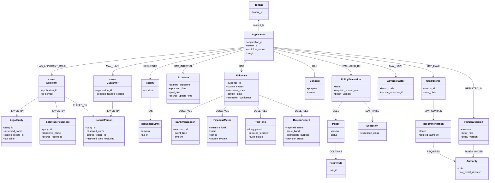
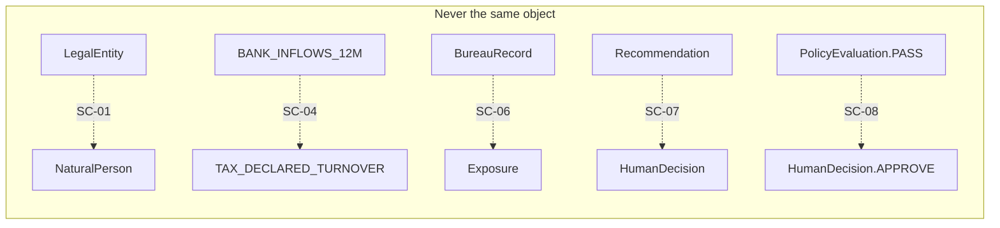

# Canonical SME Credit Domain Model

**Status:** APPROVED for workshop implementation (`CRD-CR-2026-001`)  
**Implements:** `CRD-FR-002`, `CRD-BR-002`  
**Inspectable acceptance:** `CRD-AC-016`  
**Scenario acceptance:** `CRD-AC-003`, `CRD-AC-004`, `CRD-AC-011`  
**Evidence sources:** `evidence/03_semantic_evidence/`, `evidence/01_enterprise_sources/`, `evidence/04_policy_authority/source_authority.yaml`, `evidence/02_documents/credit_underwriting_policy_v3_2.md`  
**Not a finished knowledge graph.** This spec defines types, roles, measures and forbidden equivalences. Identity *resolution* remains `CRD-FR-003`.

Do not invent production or legal classifications beyond the workshop party kinds already present in fixtures.

---

## 1. Purpose

The workbench MUST interpret heterogeneous LOS, bureau, bank, tax/GST, exposure, policy, case and memo facts using these types. A generated narrative MUST NOT invent a type, merge two types, or treat a role as a party.

---

## 2. Forbidden equivalences (non-collapse)

These pairs are **never** the same type, field, or authority object. Implementation MUST reject assignment, coercion, averaging, or aliasing between them.

| ID | Left | Right | Why | Fixture that proves it |
|---|---|---|---|---|
| SC-01 | `LegalEntity` | `NaturalPerson` | Organization identity is not a human identity. A sole trader has *both* a business party and a natural-person owner. | SME-L003 (`ORG-003` + `NP-003`) |
| SC-02 | `Applicant` | Party (`LegalEntity` / `NaturalPerson` / `SoleTraderBusiness`) | Applicant is a **role** on an application, not a party kind. | SME-L003 both parties `is_primary_applicant = 1` |
| SC-03 | `Guarantor` | `Applicant` / `LegalEntity` | Guarantor is a **role**, usually played by a `NaturalPerson`. | SME-L004 `NP-004`, SME-L013 `NP-013` |
| SC-04 | `FinancialMetric.BANK_INFLOWS_12M` | `FinancialMetric.TAX_DECLARED_TURNOVER` | Bank inflow is not declared turnover. | SME-L011 `11,068,375.24` vs `17,709,400.38` |
| SC-05 | `FinancialMetric.STATEMENT_RECOGNIZED_REVENUE` | either measure in SC-04 | Statement revenue is a third measure. | `conflicting_terms.csv` term `revenue` |
| SC-06 | `BureauRecord` | `Exposure` | Provider commercial history is not internal book exposure. | `source_authority.yaml` |
| SC-07 | `Recommendation` | `HumanDecision` | Advisory output is not the credit decision. | `CREDIT-AUTH-001`, role `AI_AGENT` |
| SC-08 | `PolicyEvaluation.result = PASS` | `HumanDecision.outcome = APPROVE` | Engine PASS is not human approval. | `conflicting_terms.csv` term `approved` |
| SC-09 | `CreditMemo` | `HumanDecision` / active `Policy` | Memo text is documentation, not authority. | Memo repository inventory |
| SC-10 | `Evidence.extraction_confidence` | creditworthiness / decision confidence | OCR confidence is extraction certainty only. | `documents_received.jsonl` `ocr_confidence` |
| SC-11 | Historical `HumanDecision` | evaluation ground truth | Prior outcomes encode policy-era and selection effects. | `evidence/05_history_feedback/README.md` |
| SC-12 | `Exception.class = MISSING_EVIDENCE` | `Exception.class = POLICY_EXCEPTION` | Different remediation and authority. | SME-L006 vs SME-L007 |

`canonical_candidate` on `identifier_crosswalk.csv` is a **hypothesis**, not a resolved `LegalEntity`. SME-L004’s three name/tax observations remain `UNRESOLVED` or `AMBIGUOUS` until adjudicated (`CRD-FR-003`).

---

## 3. Canonical types

### 3.1 Party kinds (what something *is*)

A **Party** is an identity-bearing actor. Party kind is exclusive.

| Type | Definition | Fixture `party_type` | Canonical id pattern |
|---|---|---|---|
| `LegalEntity` | Incorporated or otherwise registered organization used as a commercial borrower. | `ORGANIZATION` | `ORG-*` |
| `SoleTraderBusiness` | Business identity of a sole trader; not a company and not the owner person. | `SOLE_TRADER_BUSINESS` | `ORG-*` where applicant_type is sole_trader |
| `NaturalPerson` | A human. May be owner, guarantor, or both. | `NATURAL_PERSON_OWNER`, `NATURAL_PERSON_GUARANTOR` | `NP-*` |

`NaturalPerson` MUST NOT be stored as `LegalEntity`. `SoleTraderBusiness` MUST NOT be replaced by the owner `NaturalPerson`.

### 3.2 Roles (what a party *does* on an application)

| Type | Definition | Played by | Notes |
|---|---|---|---|
| `Applicant` | Role: the party requesting the facility. | `LegalEntity`, `SoleTraderBusiness`, and/or `NaturalPerson` | An application MAY have more than one applicant binding (sole-trader business + owner). |
| `Guarantor` | Role: a party who may be called on the facility. | Typically `NaturalPerson` in this workshop | `decision_feature_eligible` may be `CONDITIONAL`. Personal attributes are not default decision features. |

### 3.3 Application, facility, limit, exposure

| Type | Definition | Authoritative source | Must not be confused with |
|---|---|---|---|
| `Application` | Facility request and workflow case (`SME-L00x`). | LOS for workflow identity | External bureau/tax/bank identity |
| `Facility` | Product being requested: `working_capital`, `term_loan`, `invoice_finance`. | LOS `product` | An approved book facility (that is exposure / limit history) |
| `RequestedLimit` | Amount requested on this application, with currency and as-of time. | LOS `requested_limit` | Current approved limit on `Exposure` |
| `Exposure` | Internal current obligations: existing exposure, approved limit, past due. | Exposure System | `BureauRecord` external debts; requested limit |

### 3.4 Financial and external-evidence types

| Type | Definition | Authoritative source | Measure / payload |
|---|---|---|---|
| `BankTransaction` | Consented account-level cash-movement evidence. Workshop fixtures supply **summaries**, not ledgers. | Bank Data | Atomic movements when present |
| `FinancialMetric` | A typed, sourced numeric measure. `measure_kind` is mandatory. | Depends on kind | See §4 |
| `TaxFiling` | Retrieved tax/GST filing observation for a period. | Tax/GST | `declared_turnover` is `TAX_DECLARED_TURNOVER` only |
| `BureauRecord` | Provider commercial-credit observation. | Commercial Bureau | Score band, delinquency, reported name, permissible purpose |

A missing `BureauRecord` (SME-L006) stays missing. It MUST NOT be imputed as a `FinancialMetric` or `Exposure`.

### 3.5 Policy, exception, adverse

| Type | Definition | Authoritative source | Must not be confused with |
|---|---|---|---|
| `Policy` | Versioned rule bundle. Active workshop policy is `CREDIT-POLICY-3.2`. | Policy Engine / policy documents | Superseded v2.9; memo narrative |
| `PolicyRule` | A single deterministic rule (`AUTH-LIMIT-01`, `DATA-FRESHNESS-BANK`, `POL-EXC-07`, …). | Policy Engine `triggered_rule_ids` | Generated “threshold” text |
| `PolicyEvaluation` | One engine run: `result`, version, required human role, rule ids. | Policy Engine | `HumanDecision` |
| `Exception` | Governed deviation or stop. **Class is mandatory** (see taxonomy). | Policy Engine + Case Management | A single “exception queue” |
| `AdverseFactor` | A material negative factor with source evidence, used on an adverse/conditional path. | Exposure / bureau / policy | A generated decline |

`PolicyEvaluation.result` values used in fixtures: `PASS`, `REQUIRES_CREDIT_AUTHORITY`, `INSUFFICIENT_EVIDENCE`, `EXCEPTION_REVIEW`, `ADVERSE_FACTORS_REVIEW`. None of these is a `HumanDecision.outcome`.

### 3.6 Advice, decision, evidence, consent, authority

| Type | Definition | Who may create | Authority |
|---|---|---|---|
| `CreditMemo` | Structured draft or recorded narrative of an underwriting review. | Analyst or AI draft | Documentation only. Not policy. Not the decision. |
| `Recommendation` | Advisory propose / abstain / refer, with required `Authority`. | AI or analyst | Never final credit, adverse, exception, or recourse authority. |
| `HumanDecision` | Recorded approve / decline / condition / refer / escalate by an authorized role. | Human role selected by active policy | Case Management is source of truth. |
| `Evidence` | Provenance-bearing observation wrapping a source record (see `CRD-DATA-001`). | Ingestion / retrieval | Authority follows `source_authority.yaml` |
| `Consent` | Purpose-limited permission for a source use (bank, bureau, tax, documents). | LOS / data partnerships | Absence is not implied consent. |
| `Authority` | Role and scope that may take a controlled action. | Role matrix + policy route | `AI_AGENT` has `final_credit_decision = NO` |

---

## 4. Canonical financial measures

A `FinancialMetric` MUST carry `measure_kind`. The token `revenue` is **not** a legal `measure_kind`.

| measure_kind | Meaning | Authoritative source | Freshness / reuse |
|---|---|---|---|
| `BANK_INFLOWS_12M` | Provider-derived twelve-month inflows | Bank Data | Stale if older than 7 days (policy §4) |
| `BANK_OUTFLOWS_12M` | Provider-derived twelve-month outflows | Bank Data | Same |
| `TAX_DECLARED_TURNOVER` | Declared filing turnover for a period | Tax/GST | `reuse_status` CONDITIONAL in live fixtures |
| `STATEMENT_RECOGNIZED_REVENUE` | Revenue recognized on financial statements | Document Store (interpretation is not document-authoritative) | Document versioned; untrusted content |
| `INTERNAL_EXISTING_EXPOSURE` | Booked internal exposure | Exposure System | ≤15 minutes |
| `INTERNAL_APPROVED_LIMIT` | Current approved internal limit | Exposure System | ≤15 minutes |
| `INTERNAL_PAST_DUE` | Internal arrears | Exposure System | ≤15 minutes |

Disagreement between kinds is a `conflict_state`, not a number to average (`CRD-AC-011`).

---

## 5. Taxonomies

### 5.1 Identity resolution state (`CRD-FR-003`)

`MATCHED` | `AMBIGUOUS` | `UNRESOLVED`

Source observations (LOS name, bureau name/tax token, tax name) are retained after any later canonicalization.

### 5.2 Exception class

| Class | Meaning | Example |
|---|---|---|
| `MISSING_EVIDENCE` | Required external fact absent or unusable | SME-L006 bureau unavailable |
| `POLICY_EXCEPTION` | Active policy routes to exception / senior review | SME-L007 `POL-EXC-07` |
| `IDENTITY` | Party observations do not support a safe merge | SME-L004 |
| `FINANCIAL_CONFLICT` | Material measures disagree | SME-L011 |
| `FRESHNESS` | Required fact stale | SME-L005 bank 12 days |
| `ADVERSE` | Adverse-factor review | SME-L013 |

### 5.3 Recommendation versus decision outcomes

| Object | Allowed values (workshop) |
|---|---|
| `Recommendation.stance` | `PROPOSE_APPROVE`, `PROPOSE_DECLINE`, `PROPOSE_CONDITION`, `REFER`, `ABSTAIN` |
| `HumanDecision.outcome` | `APPROVE`, `DECLINE`, `CONDITION`, `REFER`, `ESCALATE` |
| `PolicyEvaluation.result` | Fixture engine results listed in §3.5 |

A `PROPOSE_*` value MUST NOT be persisted as `HumanDecision.outcome`.

### 5.4 Authority roles (from role matrix)

`RELATIONSHIP_MANAGER` | `CREDIT_ANALYST` | `SENIOR_UNDERWRITER` | `CREDIT_AUTHORITY` | `RISK_COMPLIANCE_EVAL` | `AI_AGENT`

Required role on a case is the **PolicyEvaluation** `required_human_role`, not the LOS `assigned_role` when they differ (SME-L002).

---

## 6. Relationships

| Subject | Relationship | Object | Cardinality | Temporal |
|---|---|---|---|---|
| Application | HAS_APPLICANT_ROLE | Applicant | 1..* | Application-scoped |
| Applicant | PLAYED_BY | LegalEntity, SoleTraderBusiness, or NaturalPerson | 1 | Application-scoped |
| Application | MAY_HAVE_GUARANTOR | Guarantor | 0..* | Application-scoped |
| Guarantor | PLAYED_BY | NaturalPerson (typical) or LegalEntity | 1 | Application-scoped |
| Application | REQUESTS | Facility | 1 | Application-scoped |
| Facility | HAS_REQUESTED_LIMIT | RequestedLimit | 1 | As-of request time |
| Application | HAS_EXPOSURE | Exposure | 0..1 | Source update time |
| Application | HAS_EVIDENCE | Evidence | 0..* | Versioned |
| Evidence | OBSERVES | FinancialMetric, TaxFiling, BureauRecord, BankTransaction, or document bytes | 1 | As-of |
| FinancialMetric | HAS_KIND | measure_kind | 1 | Required |
| Application | HAS_CONSENT | Consent | 0..* | Purpose-bounded |
| Application | EVALUATED_BY | PolicyEvaluation | 0..* | Versioned run |
| PolicyEvaluation | USES_POLICY | Policy | 1 | Effective interval |
| Policy | CONTAINS | PolicyRule | 1..* | Versioned |
| PolicyEvaluation | MAY_RAISE | Exception | 0..* | Run-scoped |
| Application | MAY_HAVE | AdverseFactor | 0..* | Decision-time |
| Application | MAY_HAVE | CreditMemo | 0..* | Draft or recorded |
| CreditMemo | MAY_CONTAIN | Recommendation | 0..1 | Advisory |
| Recommendation | REQUIRES | Authority | 1 | Stated on every recommendation |
| Application | RESULTED_IN | HumanDecision | 0..1 | Decision time |
| HumanDecision | TAKEN_UNDER | Authority | 1 | Role + policy version |
| Party | BELONGS_TO | Tenant | 1 | Current |

---

## 7. Physical-to-canonical mappings

| Source.field | Physical meaning | Canonical type / field | Transformation | Issue |
|---|---|---|---|---|
| LOS.application_id | Workflow application id | `Application.application_id` | Identity as-is | Not an external-entity id |
| LOS.customer_id / source_identifier | LOS customer record | Party observation `source_record_id` | Not shared with bureau/tax | Do not treat as bureau id |
| LOS.applicant_name | Workflow display name | Party `observed_name` from LOS | Keep source-tagged | May disagree with bureau/tax |
| LOS.applicant_type | Workshop party hint | Selects party kind + roles | `sole_trader` ⇒ SoleTraderBusiness + NaturalPerson owner | Not a legal classification |
| LOS.requested_limit | Requested amount | `RequestedLimit.amount` | Numeric; keep currency implicit INR in workshop | Not `Exposure.approved_limit` |
| LOS.product | Product code | `Facility.product` | Enum as supplied | |
| parties.party_type | Fixture party kind | Party kind | Map per §3.1 | Do not collapse OWNER into ORGANIZATION |
| BANK.twelve_month_inflows | Inflow sum | `FinancialMetric` kind `BANK_INFLOWS_12M` | No conversion to turnover | SC-04 |
| TAX.declared_turnover | Filing turnover | `FinancialMetric` kind `TAX_DECLARED_TURNOVER` | No conversion to inflow | SC-04 |
| BUREAU.commercial_score_band | Provider band | `BureauRecord.score_band` | Absent if no report | Do not copy onto Exposure |
| EXPOSURE.existing_exposure | Internal book | `Exposure.existing_exposure` / measure `INTERNAL_EXISTING_EXPOSURE` | | SC-06 |
| POLICY.result | Engine outcome | `PolicyEvaluation.result` | Keep version | SC-08 |
| DOCS.ocr_confidence | Extraction confidence | `Evidence.extraction_confidence` | | SC-10 |
| CASE.decision | Human outcome | `HumanDecision.outcome` | When present | Historical ≠ gold label |

---

## 8. Semantic constraints

| Constraint ID | Constraint | Type | Enforcement | Evidence |
|---|---|---|---|---|
| SEM-01 | Party kind is exclusive; a node is not both `LegalEntity` and `NaturalPerson`. | Logical | Domain model / identity layer | CRD-AC-003 |
| SEM-02 | `Applicant` and `Guarantor` are roles; they do not replace party kind. | Logical | Domain model | application_parties.csv |
| SEM-03 | `FinancialMetric` without a listed `measure_kind` is invalid. Kind `revenue` is invalid. | Logical | Domain model | conflicting_terms.csv |
| SEM-04 | Two metrics with different kinds MUST NOT be averaged or silently selected. | Logical + workflow | Evidence contract (Prompt 03) | CRD-AC-011 |
| SEM-05 | `BureauRecord` fields MUST NOT populate `Exposure`. | Logical | Domain model | source_authority.yaml |
| SEM-06 | `Recommendation` cannot be written to `HumanDecision`. | Authority | Credit authority gate (Prompt 08) | CRD-FR-007, CRD-FR-011 |
| SEM-07 | `PolicyEvaluation.PASS` does not imply evidence, identity, or freshness are clear. | Logical | Context assembly | SME-L004, L005, L011 |
| SEM-08 | Uncertain identity stays `AMBIGUOUS` / `UNRESOLVED`; `canonical_candidate` is not MATCHED. | Identity | Entity resolution (Prompt 04) | CRD-AC-004 |
| SEM-09 | Active `Policy` is `CREDIT-POLICY-3.2`; superseded documents are not `Policy` for decision context. | Authority | Policy retrieval (Prompt 05) | CRD-AC-012 |
| SEM-10 | Required role is `PolicyEvaluation.required_human_role` when it disagrees with LOS assignment. | Authority | Authority gate | SME-L002 |

High-impact authorization (SEM-06, SEM-09, SEM-10) MUST be enforced as deterministic controls, not prompt text.

---

## 9. Unresolved workshop decisions (do not invent)

| Item | Why open | Owner |
|---|---|---|
| Production legal meaning of “sole trader” vs registered firm | Case forbids invented legal classifications | Legal / compliance review |
| Exact TAT clock start for “uncomplicated” | `kpi_definition_candidates.csv` | Credit Operations |
| Whether envelope fields in `CRD-DATA-001` are MUST vs SHOULD for every fact | Spec wording conflict with `CRD-FR-002` | Spec tidy (P0-01); treat as MUST for material facts used by AI or gates until a CR says otherwise |

---

## 10. Mermaid domain model

Forbidden equivalences (not drawn as edges):

---

## 11. Executable encoding

The approved types and constraints are encoded in `src/credit_domain/`. Construction APIs MUST raise `SemanticCollapseError` on SC-01–SC-12 violations. That module is the inspectable implementation of this spec, not a credit authority.
